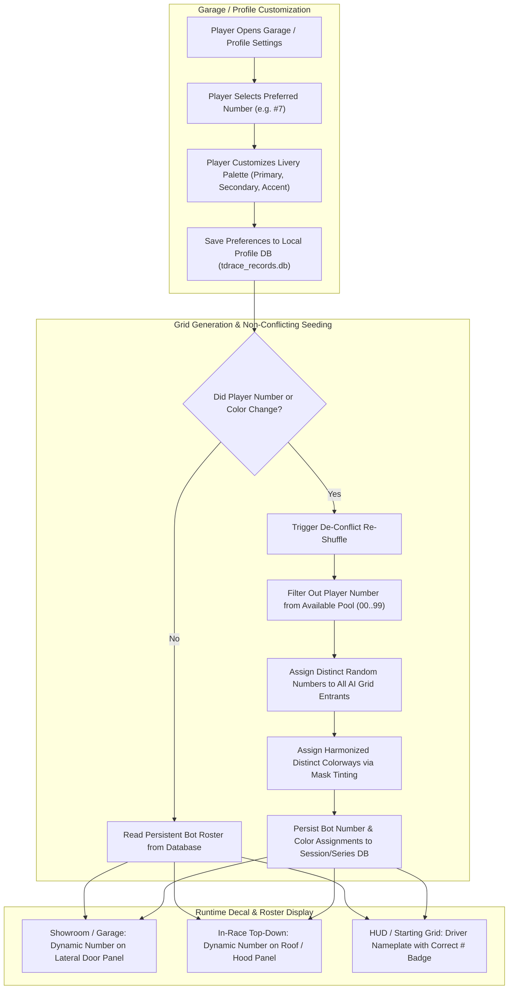

# Feature Spec: Player Preferred Racing Number Customization and Persistent Non-Conflicting Bot Grids 🏎️🔢🎨

In competitive motorsport, vehicle liveries and racing numbers are fundamental identifiers of driver identity. Previously in **TdRace**, competition numbers (e.g., `#17`, `#32`, `#3`, `#24`) and sponsor graphics were baked directly into 2D raster bitmap textures (`assets/textures/vehicles/{laterals,topdown}/**`). This caused duplicate numbers on starting grids when multiple opponents drove similar chassis, prevented players from choosing their own racing number, and created visual discrepancies between lateral showroom sprites and in-race top-down sprites.

This specification establishes:
1. **Zero-Baked-Number Base Sprites:** Complete erasure of baked numbers, brand emblems, and sponsor decals from both lateral (`1024×512`) and top-down (`512×512`) vehicle sprites, leaving clean bodywork panels and neutral number roundels.
2. **Player Number & Livery Customization:** A dedicated customization interface in the Garage / Profile allowing players to select their preferred racing number (0–999) and primary/secondary/accent colorway.
3. **Non-Conflicting Bot Grid De-Duplication:** Dynamic grid seeding that assigns unique random numbers and color schemes to all AI competitors whenever the player changes their preferences, guaranteeing zero number collisions or identical color combinations.
4. **Persistent Rival Identities:** Once assigned, AI competitors retain their numbers and liveries persistently across heats, rounds, and championships, re-shuffling only when the player updates their own selection.
5. **Procedural In-Game Decal Rendering:** Runtime projection of competition numbers onto vehicle doors (lateral) and roofs/hoods (top-down) using crisp vector typography and vehicle-specific anchor coordinates.

---

## 🗺️ User Flow & Interface Design



### 1. Garage & Profile Number Selection
In the **Garage** or **Player Profile** screen:
- A new interactive numeric selector allows the player to input or cycle their preferred competition number (`1` to `99`, or up to `999`).
- A palette selector allows picking primary, secondary, and accent paint finishes from predefined motorsport colorways.
- When saved, the preference updates `player_profile.preferred_number` and `player_profile.preferred_livery_palette`.

### 2. Live Race Grid & Top-Down In-Race Presentation
- During race heats, every vehicle displays its assigned number:
  - **Top-Down (In-Race):** Rendered onto the vehicle roof or hood centered on the designated `number_plate_topdown` coordinate derived from [`ChassisSkeleton`](075_physical_chassis_skeleton_explicit_anchor_points_and_proportional_rendering_harmonization.md).
  - **Lateral (Showroom / Garage):** Rendered onto the door panel centered on `number_plate_lateral`.
- Player vehicle displays the player's preferred number in bold, high-contrast typography.
- AI competitors each display their uniquely assigned persistent number.

---

## 🧭 Visual Standards & Technical Conventions

### 1. Sprite Clean-Up Mandate (Laterals & Top-Downs)
- **Zero Baked Numbers:** All digits (`17`, `32`, `2`, etc.) are stripped from vehicle doors, quarter panels, roofs, and hoods. Bodywork panels are smooth and clean.
- **Zero Brand IP:** All manufacturer logos (Chevy bowtie, Audi rings, Ford oval, etc.) and sponsor trademarks (Goodyear, Red Bull, Haas, STP, Michelin, etc.) are removed.
- **Top-Down & Lateral Parity:** Top-down sprites are harmonized with lateral sprites so that roof colors, hood stripes, and rear wings match identically.

### 2. Number Font & Decal Projection
- Numbers render using the game's bold motorsport typeface ([`Rajdhani-Bold`](../crates/cabinet/src/ui/font.rs)).
- High-contrast rendering: white glyphs with black outlines for dark roofs; black glyphs with white outlines for bright roofs.
- Rotation is aligned to vehicle heading $\theta$. In top-down view, digits point toward the right (+X) heading.

---

## ⚙️ Backend Models & API Endpoints

### 1. Profile & Database Schema (`crates/tdrace-app/src/db/mod.rs`)

```rust
pub struct PlayerLiveryPreference {
    pub preferred_number: u16,
    pub primary_color: [u8; 3],
    pub secondary_color: [u8; 3],
    pub accent_color: [u8; 3],
}

pub struct BotEntrantAssignment {
    pub driver_id: String,
    pub car_model_id: String,
    pub assigned_number: u16,
    pub livery_seed: u32,
    pub primary_color: [u8; 3],
    pub secondary_color: [u8; 3],
}
```

### 2. Non-Conflicting Grid Seeding Algorithm (`crates/tdrace-app/src/ai/driver.rs`)

```rust
pub fn generate_nonconflicting_grid(
    player_pref: &PlayerLiveryPreference,
    bot_roster: &[DriverProfile],
    series_seed: u64,
) -> Vec<BotEntrantAssignment> {
    let mut used_numbers = std::collections::HashSet::new();
    used_numbers.insert(player_pref.preferred_number);

    let mut rng = SmallRng::seed_from_u64(series_seed);
    let mut available_numbers: Vec<u16> = (1..=99)
        .filter(|n| !used_numbers.contains(n))
        .collect();
    available_numbers.shuffle(&mut rng);

    bot_roster
        .iter()
        .zip(available_numbers.into_iter())
        .map(|(bot, num)| {
            // Assign distinct colorway avoiding player primary
            let colorway = pick_distinct_bot_colorway(&player_pref.primary_color, &mut rng);
            BotEntrantAssignment {
                driver_id: bot.id.clone(),
                car_model_id: bot.car_model_id.clone(),
                assigned_number: num,
                livery_seed: rng.next_u32(),
                primary_color: colorway.0,
                secondary_color: colorway.1,
            }
        })
        .collect()
}
```

### 3. Persistence Rules
- **State Stability:** Bot entrant assignments are saved in `tdrace_records.db` keyed by championship session ID or modality roster key.
- **Invalidation Trigger:** Whenever `player_profile.preferred_number` or `player_profile.preferred_livery_palette` is modified by the user:
  - If any active bot entrant shares the new player number or colorway:
    - The grid generator re-allocates a non-conflicting number/color to that bot and updates the database.
  - If no conflict exists, existing bot identities remain untouched to preserve rival continuity.

---

## 🛡️ Security & Role-Based Access Controls (RBAC)

1. **Deterministic Grid Seeding Boundary**: Custom number allocation and bot de-duplication are deterministic operations executed client-side. The seeding RNG uses isolated session and seed counters, preventing race-condition corruption across concurrent local profile states.
2. **Profile Sanitization**: Custom numbers are constrained to strictly validated unsigned integer ranges (`0..=999`) and alphanumeric inputs are sanitized to prevent injection attacks or database corruption in `tdrace_records.db`.
3. **Headless Presentation Decoupling**: Vector number rendering and sprite clean-ups operate strictly within presentation-layer rendering crates (`cabinet`, `race-ui`, `tdrace-app`). Core deterministic physics simulations (`wheelbase`, `arcade-race-core`) remain free of font and visual dependencies.

---

## 🧪 Verification & Acceptance Criteria

- **Scenario: Player defines a preferred competition number**
  - [ ] **Given** the player opens the Garage or Profile menu
  - [ ] **When** the player changes their preferred racing number to "7"
  - [ ] **Then** the preference is persisted in the local profile database
  - [ ] **And** the player's car displays number "7" across showroom and in-race views

- **Scenario: Grid generation eliminates duplicate numbers**
  - [ ] **Given** the player has selected preferred number "17"
  - [ ] **When** an 8-car starting grid is launched in Single Race or Championship mode
  - [ ] **Then** exactly one vehicle on the grid carries number "17"
  - [ ] **And** all 7 AI bot competitors carry unique numbers distinct from "17" and each other
  - [ ] **And** no two cars share the same number

- **Scenario: Bot numbers and colorways remain persistent across heats**
  - [ ] **Given** a championship with 8 competitors has been generated
  - [ ] **When** the player completes Round 1 and advances to Round 2
  - [ ] **Then** every AI bot retains its exact number and colorway from Round 1
  - [ ] **And** rival driver identities remain consistent

- **Scenario: Player number change triggers non-conflicting bot re-allocation**
  - [ ] **Given** an active bot is assigned number "42"
  - [ ] **When** the player updates their preferred number to "42"
  - [ ] **Then** the grid de-conflict engine assigns a new available number to that bot
  - [ ] **And** no number collision occurs on the next starting grid

- **Scenario: Top-down and lateral sprites contain zero baked-in numbers**
  - [ ] **Given** any vehicle sprite texture in "assets/textures/vehicles/"
  - [ ] **When** scanned for baked-in door, roof, or hood numbers
  - [ ] **Then** all vehicle bodywork panels are blank of permanent numeric bitmaps
  - [ ] **And** numbers are rendered strictly via procedural decal overlays

---

## 🔗 Traceability & Codebase Mapping

### Modified Files
- `[ ]` [`crates/tdrace-app/src/profile/mod.rs`](../crates/tdrace-app/src/profile/mod.rs) -> Add preferred_number and preferred_palette fields to PlayerProfile.
- `[ ]` [`crates/tdrace-app/src/ai/driver.rs`](../crates/tdrace-app/src/ai/driver.rs) -> Implement generate_nonconflicting_grid algorithm.
- `[ ]` [`crates/tdrace-app/src/render/car.rs`](../crates/tdrace-app/src/render/car.rs) -> Procedural dynamic number projection on vehicle doors and roofs.
- `[ ]` [`crates/tdrace-app/src/ui/garage.rs`](../crates/tdrace-app/src/ui/garage.rs) -> Interactive number selector and livery color picker.

### Verification Assertions
- Verification receipts will be recorded via `keel receipt 092 --cmd "cargo test -p tdrace-app test_grid_number_deconfliction"`.

