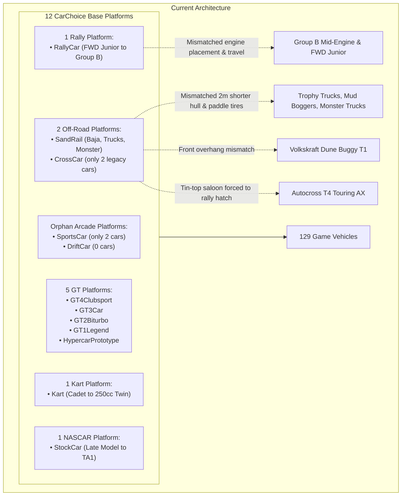
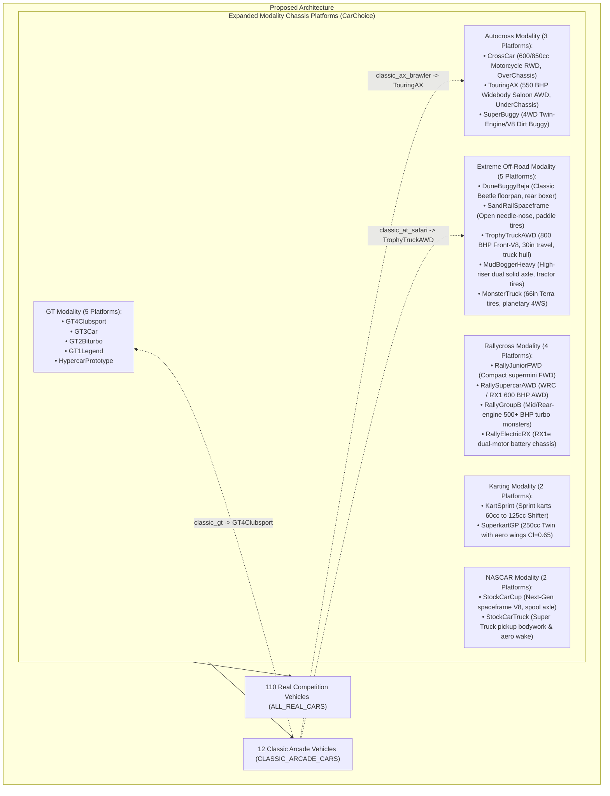

# Architecture Spec: Modality Chassis Platforms Architecture Expansion and Arcade Alignment 🏎️📐🏗️

An architectural specification for **TdRace** extending [`crates/wheelbase`](../crates/wheelbase), [`crates/arcade-race-core`](../crates/arcade-race-core), and [`crates/tdrace-app`](../crates/tdrace-app). This architecture expands the canonical base chassis platform taxonomy (`CarChoice`) beyond the initial GT paradigm to authentically represent distinct vehicular architectures across **Autocross**, **Extreme Off-Road**, **Rallycross**, **Karting**, and **NASCAR**, eliminates redundant standalone "arcade-only" chassis platforms (`SportsCar`, `DriftCar`) by aligning Classic Arcade vehicles directly with their governing motorsport modalities, and guarantees physical axle alignment, collision hull accuracy, and automated top-down steered wheel articulation ([Spec 091](091_global_prebaked_vehicle_steered_wheel_articulation.md)).

---

## 🎯 Executive Summary & Problem Statement

### 1.1 The Monolithic Platform Overfitting Trap
When [Spec 075](075_physical_chassis_skeleton_explicit_anchor_points_and_proportional_rendering_harmonization.md) (Chassis Skeleton) and [Spec 076](076_pragmatic_multi_tier_suspension_archetypes_and_perceptible_compliance.md) (Suspension Archetypes) were introduced, the Grand Touring (`gt`) module was equipped with five distinct, highly calibrated base platforms corresponding to each competitive tier (`GT4Clubsport`, `GT3Car`, `GT2Biturbo`, `GT1Legend`, `HypercarPrototype`). 

In contrast, other motorsport disciplines were over-fitted onto singular, coarse baseline presets:
1. **Autocross Overfitting**: 420 kg single-seat motorcycle-engine Cross Cars (T1/T2), 550 kg Buggy 1600s (T3), and 750 BHP SuperBuggies (T5) are forced onto `SandRail` (a desert sand dune rail buggy with giant rear paddle tires and needle-nose geometry), while 550+ BHP closed-cockpit Touring AX saloons (T4) are forced onto `RallyCar` (a soft gravel rally hatchback).
2. **Extreme Off-Road Overfitting**: 21 radically diverse vehicles spanning 590 kg air-cooled Baja buggies (`offroad_volkskraft_dune_t1`), 2,400 kg V8 Trophy Trucks, 2,800 kg tractor-tire Mud Boggers, 4,500 kg Monster Trucks with 66-inch Terra tires, and 1,350 kg Stadium Super Trucks are compressed into only two platforms: `SandRail` and `RallyCar`.
3. **The Volkskraft Dune Buggy Anomaly**: The classic Baja Bug / Dune Buggy (`offroad_volkskraft_dune_t1`) possesses a distinct Beetle floorpan with a forward-curving front fiberglass nose ($d_f \approx 0.42\text{ m}$), a compact $2.20\text{ m}$ wheelbase, and an exposed rear-hung air-cooled boxer engine ($d_r \approx 0.52\text{ m}$). Forcing it onto the long, needle-nosed `SandRail` ($d_f = 0.15\text{ m}, L = 2.40\text{ m}$) completely misaligns its front wheel arches.
4. **The "Arcade Platform" Disconnect**: The codebase maintains two legacy chassis presets—`CarChoice::SportsCar` and `CarChoice::DriftCar`—that are not used by any vehicle in the 110-car production catalog (`ALL_REAL_CARS`). Only `classic_gt` and `classic_gt_vintage` use `SportsCar`, while all other classic arcade vehicles already borrow from real motorsport modalities (`StockCar`, `RallyCar`, `Kart`, `SandRail`, `CrossCar`).

### 1.2 Impact on Simulation, Damage, and Wheel Articulation
In `tdrace`, vehicle models (`RealCarModel`) scale mass, tractive force, and top speed via `to_car_config()`, but **inherit structural chassis dimensions directly from their base `CarChoice`**:
* **Steered Wheel Articulation ([Spec 091](091_global_prebaked_vehicle_steered_wheel_articulation.md))**: Wheel hub anchors are dynamically derived via $\mathbf{p}_{\text{FL}} = \mathbf{p}_{\text{chassis}} + \hat{\mathbf{f}} \cdot l_f - \hat{\mathbf{r}} \cdot w_f$. If a 2,400 kg Trophy Truck inherits `SandRail` ($l_f = 1.44\text{ m}, w_f = 0.875\text{ m}$), the steered front wheels float deep inside the truck's hood or miss the wheel wells entirely.
* **SAT Collision Hulls ([Spec 075](075_physical_chassis_skeleton_explicit_anchor_points_and_proportional_rendering_harmonization.md))**: Collision bounding boxes are generated from `(lf + front_overhang, lr + rear_overhang, half_width)`. A 5.1-meter Trophy Truck on a 2.97-meter Sand Rail chassis visually penetrates walls and opponents by more than 2 meters before registering contact.
* **Directional Collision Damage ([Spec 078](078_directional_impact_masking_engine_placement_damage_and_archetype_suspension_failure.md))**: Damage distribution depends on `EnginePlacement`. A front-engine Trophy Truck or Stadium Truck simulated as a rear-engine `SandRail` takes $0\%$ engine damage in head-on barrier crashes.

---

## 🗺️ Current vs. Proposed System Architecture

### 1. Current Architecture (Monolithic Platform Overfitting & Orphan Arcade Platforms)



### 2. Proposed Architecture (Modality-Aligned Expanded Chassis Taxonomy)



---

## 📐 Data Models & Mathematical Specifications

### 1. `CarChoice` Enum Expansion in `crates/tdrace-app/src/ui/menu.rs`

Replace orphan arcade variants and expand modality-specific platforms:

```rust
#[derive(Debug, Clone, Copy, PartialEq, Eq, Hash, Serialize, Deserialize)]
pub enum CarChoice {
    // 1. Grand Touring (GT)
    GT4Clubsport,
    GT3Car,
    GT2Biturbo,
    GT1Legend,
    HypercarPrototype,

    // 2. Continental Autocross (AX)
    CrossCar,          // T1 & T2: 600cc-850cc RWD motorcycle-engine single-seat buggy
    TouringAX,         // T4: 550+ BHP closed silhouette touring saloon, AWD, front splitter
    SuperBuggy,        // T3 & T5: 4WD mid-engine dirt spaceframe buggy (Buggy 1600 & SuperBuggy)

    // 3. Extreme Off-Road & Stunt
    DuneBuggyBaja,     // T1: Volkskraft classic rear-hung air-cooled boxer, Beetle geometry
    SandRail,          // T1: Needle-nosed open chromoly sand rail with paddle tires
    TrophyTruckAWD,    // T2, T6, T7: 800 BHP front V8, 3.2m wheelbase, 30in travel, truck hull
    MudBoggerHeavy,    // T4: High-riser dual solid live axle 4x4, tractor tires (hcg = 0.65m)
    MonsterTruck,      // T5: 1500 BHP supercharged V8, 66in Terra tires, 4-wheel steer

    // 4. Rallycross (RX)
    RallyJuniorFWD,    // T1: Compact FWD supermini rally hatch
    RallyCar,          // T2, T3, T4: WRC & RX Supercar AWD 50:50, long travel
    RallyGroupB,       // T7: Mid/Rear-engine 500+ BHP lightweight turbo monsters
    RallyElectricRX,   // T5 & T6: RX1e / Group E low-CG dual-motor battery chassis

    // 5. Karting
    Kart,              // T1-T4: Sprint kart chassis (Cadet 60cc to 125cc Shifter KZ)
    SuperkartGP,       // T5-T6: 250cc Superkart with front/rear aerodynamic wings (Cl = 0.65)

    // 6. Stock Car & NASCAR
    StockCar,          // T1, T2, T3, T5: Cup & Late Model spaceframe V8, solid live axle
    StockCarTruck,     // T4: Craftsman V8 Super Truck, high greenhouse, pickup bed wake
}
```

---

### 2. Physical Archetype Calibration Matrix

Standardized dimensions, overhangs, suspension archetypes, and engine placements across all newly added platforms:

| Platform ID | Wheelbase ($L$) | Track ($W_t$) | Front Overhang ($d_f$) | Rear Overhang ($d_r$) | Body Width ($W_b$) | Suspension (F / R) | Engine Placement | Wheel Layering |
| :--- | :--- | :--- | :--- | :--- | :--- | :--- | :--- | :--- |
| **`CrossCar`** | $2.15\text{ m}$ | $1.55\text{ m}$ | $0.22\text{ m}$ | $0.28\text{ m}$ | $1.65\text{ m}$ | LongTravel / LongTravel | `MidEngine` | `OverChassis` |
| **`TouringAX`** | $2.55\text{ m}$ | $1.85\text{ m}$ | $0.85\text{ m}$ | $0.78\text{ m}$ | $1.92\text{ m}$ | DoubleWishbone / DoubleWishbone | `FrontEngine` | `UnderChassis` |
| **`SuperBuggy`** | $2.60\text{ m}$ | $1.82\text{ m}$ | $0.24\text{ m}$ | $0.48\text{ m}$ | $1.90\text{ m}$ | LongTravel / LongTravel | `MidEngine` | `OverChassis` |
| **`DuneBuggyBaja`** | $2.20\text{ m}$ | $1.65\text{ m}$ | $0.42\text{ m}$ | $0.52\text{ m}$ | $1.75\text{ m}$ | LongTravel / LongTravel | `RearEngine` | `OverChassis` |
| **`TrophyTruckAWD`** | $3.20\text{ m}$ | $2.10\text{ m}$ | $0.95\text{ m}$ | $1.20\text{ m}$ | $2.25\text{ m}$ | LongTravel / SolidLiveAxle | `FrontEngine` | `UnderChassis` |
| **`MudBoggerHeavy`** | $3.10\text{ m}$ | $2.25\text{ m}$ | $0.90\text{ m}$ | $1.15\text{ m}$ | $2.35\text{ m}$ | SolidLiveAxle / SolidLiveAxle | `FrontEngine` | `UnderChassis` |
| **`MonsterTruck`** | $3.60\text{ m}$ | $2.60\text{ m}$ | $0.80\text{ m}$ | $0.80\text{ m}$ | $2.75\text{ m}$ | LongTravel / LongTravel | `MidEngine` | `OverChassis` |
| **`RallyJuniorFWD`** | $2.35\text{ m}$ | $1.50\text{ m}$ | $0.72\text{ m}$ | $0.58\text{ m}$ | $1.72\text{ m}$ | MacPhersonStrut / DoubleWishbone| `FrontEngine` | `UnderChassis` |
| **`RallyGroupB`** | $2.30\text{ m}$ | $1.68\text{ m}$ | $0.78\text{ m}$ | $0.75\text{ m}$ | $1.85\text{ m}$ | DoubleWishbone / LongTravel | `MidEngine` | `UnderChassis` |
| **`SuperkartGP`** | $1.25\text{ m}$ | $1.05\text{ m}$ | $0.32\text{ m}$ | $0.35\text{ m}$ | $1.20\text{ m}$ | RigidKart / RigidKart | `MidEngine` | `OverChassis` |
| **`StockCarTruck`** | $2.85\text{ m}$ | $1.86\text{ m}$ | $0.96\text{ m}$ | $1.35\text{ m}$ | $2.00\text{ m}$ | DoubleWishbone / SolidLiveAxle | `FrontEngine` | `UnderChassis` |

---

### 3. Catalog Vehicle Re-Mapping Matrix

#### A. Classic Arcade Roster (`CLASSIC_ARCADE_CARS`) Alignment
Eliminate reliance on orphan arcade platforms:
* `classic_gt` (Apex Phantom GT) $\to$ `CarChoice::GT4Clubsport`
* `classic_gt_vintage` (Corsica '73 RS) $\to$ `CarChoice::GT4Clubsport`
* `classic_nascar` (Thunderbolt Stock V8) $\to$ `CarChoice::StockCar`
* `classic_stock_vintage` (Cyclone '69 Fastback) $\to$ `CarChoice::StockCar`
* `classic_offroad` (Vortex Dune Crusher) $\to$ `CarChoice::SandRail`
* `classic_at_safari` (Ironclad 4x4 Safari) $\to$ `CarChoice::TrophyTruckAWD`
* `classic_kart` (Turbo Dart 200cc) $\to$ `CarChoice::Kart`
* `classic_kart_vintage` (Comet 100 Classic) $\to$ `CarChoice::Kart`
* `classic_rally` (Trailfire Turbo 4WD) $\to$ `CarChoice::RallyCar`
* `classic_rx_vintage` (Firebolt RS 2000) $\to$ `CarChoice::RallyJuniorFWD` (or RWD rally)
* `classic_ax_mudlark` (Mudlark Cross Car) $\to$ `CarChoice::CrossCar`
* `classic_ax_brawler` (Brawler Touring AX) $\to$ `CarChoice::TouringAX`

#### B. Continental Autocross (`autocross`) Alignment
* **T1 & T2 (Cross Cars)**: Ardennes Junior, Iberian Furia, Cosmo Nova, Ardennes Pro, Iberian Relampago, Lusitania Bravo $\to$ **`CarChoice::CrossCar`**
* **T3 (Buggy 1600)**: Petersen Buggy 1600, Bologna Buggy 1600, Rapid Dynamics Buggy 1600 $\to$ **`CarChoice::SuperBuggy`**
* **T4 (Touring AX Saloons)**: Bohemia Veloce, Shinano Tsunami, Vortek Quattro Touring $\to$ **`CarChoice::TouringAX`**
* **T5 (SuperBuggy Biturbo)**: Petersen SuperBuggy V8, Bologna SuperBuggy, Rapid Dynamics SuperBuggy $\to$ **`CarChoice::SuperBuggy`**

#### C. Extreme Off-Road (`extreme_offroad`) Alignment
* **T1 (Baja Bug)**: `offroad_volkskraft_dune_t1` $\to$ **`CarChoice::DuneBuggyBaja`**
* **T1 (Spaceframe Rails)**: Laurentian Nomad, Northstar Razor $\to$ **`CarChoice::SandRail`**
* **T2 (AWD Trophy Trucks)**: Desert Forge, Bettantown Unlimited, Sonora Desert King $\to$ **`CarChoice::TrophyTruckAWD`**
* **T3 (Ice Racers)**: Sixstar Blizzard, Vortek Glacier, Shinano Frost $\to$ **`CarChoice::RallyCar`**
* **T4 (Heavy Mud Boggers)**: Titan Mud Slinger, Crossbow Ridge, Forge Mammoth $\to$ **`CarChoice::MudBoggerHeavy`**
* **T5 (Monster Trucks)**: Havoc Tomb Raider, Havoc Overkill, Colossus Titan $\to$ **`CarChoice::MonsterTruck`**
* **T6 (Desert Raid T1+)**: Yamato Sahara Raid, Vortek Electro Raid, Proline Predator $\to$ **`CarChoice::TrophyTruckAWD`**
* **T7 (Stadium Super Trucks)**: Stadium Thunder V8, Stadium Thunder Pro, Stadium Thunder Apex $\to$ **`CarChoice::TrophyTruckAWD`**

#### D. Rallycross (`rally`) Alignment
* **T1 (Rally Junior FWD)**: Gallia 200, Forge Spark, Rouen Dauphine $\to$ **`CarChoice::RallyJuniorFWD`**
* **T2, T3, T4 (Supercar Lites & WRX Supercars)**: $\to$ **`CarChoice::RallyCar`**
* **T5 & T6 (RX1e & Group E)**: Gallia Volt, Volkskraft Electro, Nordic Valkyrie $\to$ **`CarChoice::RallyElectricRX`**
* **T7 (Group B Legends)**: Torino Stradale S4, Gallia Corsica Turbo, Vortek Turbo Quattro $\to$ **`CarChoice::RallyGroupB`**

#### E. Karting (`kart`) Alignment
* **T1–T4 (Cadet, Junior, Senior, Shifter KZ)**: $\to$ **`CarChoice::Kart`**
* **T5–T6 (Superkart 250cc Single & Twin GP)**: Highland Hawk, Moravia Arrow, Vanguard Spyder, Highland Eagle, Moravia Falcon, Venom Cobra $\to$ **`CarChoice::SuperkartGP`**

#### F. NASCAR (`nascar`) Alignment
* **T1, T2, T3, T5 (Street Stock, Late Model, Premier, Silhouette TA1)**: $\to$ **`CarChoice::StockCar`**
* **T4 (V8 Super Trucks)**: Crossbow Sierra V8, Forge Ironclad V8, Yamato Taiga V8 $\to$ **`CarChoice::StockCarTruck`**

---

## 🗄️ Database & Storage Migration Plan

### 1. Serde Schema Compatibility
* `CarChoice` implements `Serialize` and `Deserialize` using `#[serde(rename_all = "snake_case")]` or direct identifier mapping.
* The retired `SportsCar` and `DriftCar` variants are preserved with `#[serde(other)]` or aliases pointing to `GT4Clubsport` to ensure legacy JSON replays or test telemetry deserialize without panics.
* `tdrace_records.db` persists model IDs (e.g. `classic_gt`, `offroad_volkskraft_dune_t1`), not raw `CarChoice` enum strings. Therefore, **zero database migrations or SQLite table alterations are required**.

### 2. Codex Portal Synchronization (`portals/codex`)
* The Rust Codex exporter (`crates/tdrace-app/src/codex/mod.rs`) iterates over `CarChoice::ALL`.
* Adding the new platforms automatically generates rich technical reference cards for each distinct modality platform in `portals/shared/data/codex/platforms.json`.

---

## 🔑 Security, Compliance, & IAM Roles

### 1. Deterministic Simulation Invariance
* Chassis skeletons define constants: mass distribution, wheelbase, overhangs, and track width.
* Because all calculations remain strictly algebraic in 32-bit floats without non-deterministic allocations, peer-to-peer and client-host synchronization ([Spec 044](044_robust_lan_race_synchronization_with_ownerauthoritative_cars.md)) remains bit-identical.

### 2. Fair Homologation & Collision Envelopes
* SAT Oriented Bounding Boxes derive directly from the updated `ChassisSkeleton`. Opponent vehicles cannot visually pass through track walls or clip into each other during close pack racing.

---

## 🛡️ Disaster Recovery, Monitoring, & Fallbacks

### 1. Dimension Clamping Guards
In `CarConfig::finalize()`:
* $L_{\text{wheelbase}} \in [0.90, 4.50]\text{ m}$
* $W_{\text{track}} \in [0.70, 3.00]\text{ m}$
* $d_{\text{front}}, d_{\text{rear}} \in [0.10, 2.00]\text{ m}$
* Guards prevent zero-division in camera follow-lag and numerical overflow in Ackermann steering geometry.

### 2. Regression Safety
* All golden physics test suites (`tests/golden_sim.rs`, `turning_benchmark.rs`) must execute and verify that existing lap-time profiles remain calibrated within $\pm 2.5\%$.

---

## 🧪 Verification & Acceptance Criteria

### Automated Tests
- Command to run wheelbase configuration tests: `cargo test -p wheelbase`
- Command to run app handling and catalog tests: `cargo test -p tdrace-app`
- Command to run codex export verification: `cargo test -p tdrace-app --test codex_export_tests`

### Manual Acceptance Criteria (Pseudo-Gherkin)

- **Scenario: Classic Arcade vehicles inherit authentic modality platforms**
  - [x] **Given** the vehicle catalog in `crates/tdrace-app/src/catalog/mod.rs`
  - [x] **When** inspecting `classic_gt`, `classic_ax_brawler`, and `classic_at_safari`
  - [x] **Then** `classic_gt` uses a GT platform (`GT4Clubsport` or `GT3Car`)
  - [x] **And** `classic_ax_brawler` uses `TouringAX`
  - [x] **And** `classic_at_safari` uses `TrophyTruckAWD`
  - [x] **And** no active production vehicle requires `CarChoice::SportsCar` or `CarChoice::DriftCar`

- **Scenario: Autocross T4 Touring AX saloons possess dedicated touring geometry**
  - [x] **Given** the Autocross vehicle roster
  - [x] **When** resolving the physics configuration for `autocross_bohemia_veloce_t4`
  - [x] **Then** its base chassis is `TouringAX` with $W_{\text{track}} \ge 1.85\text{ m}$ and front overhang $d_f \ge 0.80\text{ m}$
  - [x] **And** its wheel layering mode in Spec 091 resolves to `UnderChassis` (wheels inside fenders)
  - [x] **And** its front engine placement causes frontal collisions to route energy into the engine block

- **Scenario: Volkskraft Dune Buggy T1 possesses distinct Baja geometry from Sand Rail**
  - [x] **Given** `offroad_volkskraft_dune_t1` and `offroad_laurentian_nomad_t1` in Extreme Off-Road
  - [x] **When** comparing their resolved `ChassisSkeleton` and `wheelbase`
  - [x] **Then** `Volkskraft` uses `DuneBuggyBaja` with rear overhang $d_r \ge 0.50\text{ m}$ and front overhang $d_f \ge 0.40\text{ m}$
  - [x] **And** `Laurentian Nomad` uses `SandRail` with needle-nose front overhang $d_f \le 0.18\text{ m}$
  - [x] **And** both vehicles correctly position steered wheels at their respective physical front axles without sprite clipping

- **Scenario: Trophy Trucks and Monster Trucks possess accurate truck-scale collision hulls**
  - [x] **Given** `offroad_desert_forge_truck_t2` and `offroad_colossus_titan_t5`
  - [x] **When** constructing the SAT `BodyHull`
  - [x] **Then** the Trophy Truck hull length is $\ge 5.0\text{ m}$ (wheelbase $3.20\text{ m} + d_f + d_r$)
  - [x] **And** the Monster Truck hull width is $\ge 2.6\text{ m}$ with 66-inch Terra wheel dimensions
  - [x] **And** neither vehicle is constrained by the 2.97-meter `SandRail` chassis bounding box

- **Scenario: Spec 091 steered wheel derivation succeeds globally across all expanded platforms**
  - [x] **Given** any of the 122+ vehicles across all 8 modules
  - [x] **When** calling `derive_steered_wheel_config(model_id, &car_config)`
  - [x] **Then** `front_axle_offset` exactly equals `car_config.cg_to_front`
  - [x] **And** `half_track_width` exactly equals `car_config.track_width * 0.5`
  - [x] **And** `wheel_size` matches the corner tire dimensions of the assigned platform

---

## 🔗 Traceability & Codebase Mapping

### Modified Files
- `[x]` [`crates/wheelbase/src/config.rs`](../crates/wheelbase/src/config.rs) -> Adds factory constructors for `touring_ax()`, `super_buggy()`, `dune_buggy_baja()`, `trophy_truck()`, `mud_bogger()`, `monster_truck()`, `superkart_gp()`, `stock_car_truck()`, `rally_junior_fwd()`, `rally_group_b()`.
- `[x]` [`crates/tdrace-app/src/ui/menu.rs`](../crates/tdrace-app/src/ui/menu.rs) -> Expands `CarChoice` enum variants, titles, descriptions, and `config()` dispatch.
- `[x]` [`crates/tdrace-app/src/catalog/mod.rs`](../crates/tdrace-app/src/catalog/mod.rs) -> Re-maps `ALL_REAL_CARS` and `CLASSIC_ARCADE_CARS` to their authentic modality base platforms.
- `[x]` [`crates/tdrace-app/src/render/vehicle_assets.rs`](../crates/tdrace-app/src/render/vehicle_assets.rs) -> Updates wheel layering and wheel texture styles for new platforms.
- `[x]` [`crates/tdrace-app/src/codex/mod.rs`](../crates/tdrace-app/src/codex/mod.rs) -> Synchronizes Codex export for the expanded platform roster.
- `[x]` [`specs/constitution/ROADMAP.md`](constitution/ROADMAP.md) -> Tracks Spec 094 in Phase 6 milestones.
