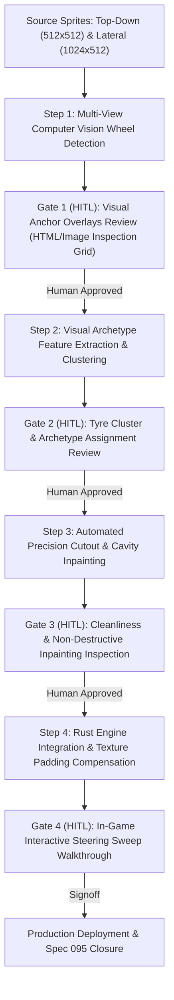

# Feature Spec: Multi-View Sprite Wheel Anchor Extraction, Archetype Clustering, and Precision Articulation 🏎️🔍🛞

A comprehensive vehicle rendering, computer vision asset calibration, and visual kinematics specification amending [Spec 091](091_global_prebaked_vehicle_steered_wheel_articulation.md) to achieve pixel-perfect Ackermann steered wheel animation globally across every vehicle in **TdRace**.

While Spec 091 established global steered wheel activation across all 122+ vehicles, its mathematical derivation assumed that the 2D raster vehicle sprites strictly obeyed theoretical physics values ($X_{\max} - d_f \cdot S$). In reality, raster vehicle artwork possesses authentic visual geometry that diverges from generic platform physics templates by up to 70–100 px longitudinally and 50–160 px laterally. This caused significant visual regressions:
1. **Residual tyre fragments**: Wheel cutouts were offset from real wheel wells, chopping into bumpers and headlights while leaving the original tires drawn on the sprite.
2. **Tiny animated wheels**: A rigid $2.0 \cdot \text{size}_x$ clamp discarded physical wheel radius, ignored transparent margins in wheel textures, and forced massive Monster Trucks and Mud Boggers to share a narrow buggy tire.
3. **Severe wheel misalignment**: Karts displayed floating wheels 20 cm in front of and outside the chassis, while off-road buggies had wheels pinched too close together.

This specification resolves these defects by introducing **dual-view (cenital top-down + lateral side profile) image analysis**, automated **visual archetype clustering**, dedicated **high-fidelity tire archetypes** (Monster Truck, Mud Bogger, Trophy Truck, Buggy), texture padding compensation, and mandatory **Human-in-the-Loop (HITL) visual verification gates** at intermediate calibration steps.

---

## 🗺️ User Flow & Interface Design

### 1. In-Race Dynamic Presentation
During active racing, every vehicle presents an articulated mechanical assembly with zero visual compromises:
* **Open-Wheel Archetypes (Karts, Buggies, Cross Cars, Monster Trucks):** Front steered wheels sit flush against suspension spindles with zero residual tire ghosting on the chassis, wishbones seamlessly connecting to inner wheel hubs, and tire footprints matching the rear axle tires in scale and tread aggression.
* **Closed-Wheel Archetypes (GT, NASCAR, Rally, Trophy Trucks):** Steered wheels rotate cleanly within their authentic hollowed fender apertures. Dark ambient cavity liners remain centered on the wheel wells, preventing track see-through during lateral chassis roll ($\pm 18\,\text{cm}$) without cutting into headlights or front splitters.
* **Compound Visual Decoupling (Spec 089 Parity):** Animated wheels render clean black rubber matching their designated motorsport archetype, while compound telemetry remains housed in the Tactical Cockpit HUD.

### 2. Human-in-the-Loop (HITL) Visual Verification Gates
To prevent unverified batch modifications across 122+ vehicles, the pipeline establishes four sequential, non-skippable visual verification gates:



* **Gate 1: Multi-View Visual Anchor Overlays (`artifacts/hitl/gate1_anchor_overlays/`)**:
  Generates high-contrast diagnostic images for every vehicle:
  - Top-down view with detected front wheel bounding boxes and track centerline marked in bright green.
  - Lateral view with detected front and rear wheel circles, hub centers, and outer tire diameters marked in yellow/cyan.
  - Generates an HTML inspection report `gate1_anchor_review.html` for rapid visual pass/fail signoff.
* **Gate 2: Tyre Cluster & Archetype Assignment Review (`artifacts/hitl/gate2_clusters/`)**:
  Presents cropped lateral and cenital wheel patches grouped by cluster (e.g. Kart Slicks, GT Low-Profile, NASCAR Tall-Sidewall, Rally Gravel, Buggy All-Terrain, Trophy Truck Heavy, Mud Paddle, Monster Terra). The human reviewer confirms or adjusts cluster-to-texture mappings.
* **Gate 3: Cutout Cleanliness & Cavity Inspection (`artifacts/hitl/gate3_cutouts/`)**:
  Provides side-by-side diffs of `<model_id>.png` vs `<model_id>_chassis.png`:
  - Verifies 100% removal of drawn front tire rubber.
  - Confirms zero clipping of wishbones, front wings, splitters, or headlights.
  - Validates dark cavity inpainting placement inside the real fender liners.
* **Gate 4: In-Game Interactive Steering Sweep**:
  Live interactive execution testing full left-to-right steering lock sweep across diverse archetype representatives (`kart_blackline_cadet_t1`, `offroad_havoc_overkill_t5`, `offroad_volkskraft_dune_t1`, `offroad_desert_forge_truck_t2`, `gt_vandorn_arrowhead_t2`).

---

## ⚙️ Backend Models & API Endpoints

### 1. Dual-View (Cenital + Lateral) Coordinate Fusion
Top-down views alone cannot reliably determine tire diameter on closed-wheel vehicles because the top half of the tire is occluded by the fender arch. Conversely, lateral views expose the entire wheel profile but provide zero track width information.

```
       TOP-DOWN (CENITAL) VIEW                     LATERAL (SIDE PROFILE) VIEW
   ┌───────────────────────────────┐           ┌─────────────────────────────────┐
   │                               │           │                                 │
   │      ┌─┐             ┌─┐      │           │                                 │
   │      │X│  ◄─Track─►  │X│      │           │          O             O        │
   │      └─┘             └─┘      │           │      (Rear Hub)   (Front Hub)   │
   │      FL              FR       │           │                       ◄──D──►   │
   │       ▲                       │           │                                 │
   │    Axle X                     │           │                                 │
   └───────────────────────────────┘           └─────────────────────────────────┘
    Yields: Axle X, Track Width,                Yields: Wheel Diameter (D),
    Tread Width (W), Cavity Aperture            Longitudinal Hub X, Rim Ratio
```

#### Dual-View Calibration Model:
1. **Lateral Image Processing ($1024 \times 512\,\text{px}$, facing $+X$):**
   - Vehicle ground-plane detection and bumper bounds $[X_{\text{lat\_min}}, X_{\text{lat\_max}}]$.
   - Circular Hough transform and dark-annulus radial gradient detection around expected axle zones:
     $$\mathbf{C}_{\text{lat\_front}} = (X_{\text{hub\_lat}}, Y_{\text{hub\_lat}}), \quad R_{\text{lat\_tire}} = \text{outer radius (px)}$$
   - Computes authentic visual wheel diameter ratio relative to vehicle length:
     $$\rho_{\text{diam}} = \frac{2 \cdot R_{\text{lat\_tire}}}{X_{\text{lat\_max}} - X_{\text{lat\_min}}}$$
2. **Cenital Top-Down Processing ($512 \times 512\,\text{px}$, facing $+X$):**
   - Bounding box $[X_{\text{cen\_min}}, X_{\text{cen\_max}}]$ and lateral centerline $Y_{\text{center}}$.
   - Dark rubber color segmentation ($R, G, B \le 75$, saturation $\le 30$, $\alpha \ge 40$).
   - Longitudinal axle alignment: $X_{\text{axle\_cen}}$ is constrained by lateral hub ratio:
     $$X_{\text{axle\_cen}} \approx X_{\text{cen\_max}} - (X_{\text{lat\_max}} - X_{\text{hub\_lat}}) \cdot \left(\frac{W_{\text{cen}}}{W_{\text{lat}}}\right)$$
   - In open-wheel vehicles, $X_{\text{axle\_cen}}$ and track width $W_{\text{track\_cen}}$ are directly measured from the segmented rubber centroids with sub-pixel moment analysis.
3. **Visual Wheel Anchor Descriptor (`visual_wheel_anchors.json`):**
   ```json
   {
     "kart_blackline_cadet_t1": {
       "axle_x_px": 369.0,
       "track_width_px": 151.0,
       "tire_length_px": 86.0,
       "tire_width_px": 38.0,
       "archetype": "kart_slick_front",
       "layering": "OverChassis"
     }
   }
   ```

---

### 2. Visual Archetype Clustering & Dedicated Textures
Rather than assigning a generic fallback texture, the pipeline extracts feature vectors from the detected wheel patches:
$$\mathbf{v} = \left[ \rho_{\text{diam}}, \, \frac{\text{tire\_width}}{\text{tire\_diameter}}, \, \text{rim\_diameter\_ratio}, \, \text{tread\_roughness} \right]$$

Unsupervised clustering ($k$-means with silhouette validation) partitions the fleet into authentic motorsport archetypes:

| Tyre Archetype ID | Target Disciplines | Visual Profile | Asset Path |
| :--- | :--- | :--- | :--- |
| `kart_slick_front` | Karting (Cadet, Superkart) | Tiny diameter, wide slick tread, small exposed rim | `assets/textures/vehicles/topdown/wheels/kart_slick_front.png` |
| `gt_slick_front` | GT4, GT3, GT2, GT1, Hypercar | Large alloy rim, ultra-low profile slick | `assets/textures/vehicles/topdown/wheels/gt_slick_front.png` |
| `nascar_wheel_front` | Stock Car, Stock Truck | Tall sidewall, deep-dish steel rim, yellow lettered | `assets/textures/vehicles/topdown/wheels/nascar_wheel_front.png` |
| `rally_wheel_front` | Rallycross, Junior FWD, RX Lites | Reinforced OZ-style rim, grooved gravel/tarmac | `assets/textures/vehicles/topdown/wheels/rally_wheel_front.png` |
| `buggy_allterrain_front` | Sand Rail, Cross Car, Baja Buggy | Ribbed steer tread or lightweight knobby | `assets/textures/vehicles/topdown/wheels/buggy_allterrain_front.png` |
| `truck_allterrain_front` | Trophy Truck, Mud Slinger | Heavy aggressive knobby off-road tread, beadlock | `assets/textures/vehicles/topdown/wheels/truck_allterrain_front.png` |
| `monster_wheel_front` | Monster Truck | Massive 66" Terra agricultural chevron V-tread | `assets/textures/vehicles/topdown/wheels/monster_wheel_front.png` |
| `mud_tractor_front` | Mud Bogger Heavy | Deep-lug directional tractor paddle tread | `assets/textures/vehicles/topdown/wheels/mud_tractor_front.png` |

---

### 3. Texture Padding Compensation & Exact Runtime Scaling

Standalone wheel textures are stored on standardized canvases ($128 \times 256\,\text{px}$) with internal transparent margins. Rendering naive bounding boxes causes the visible rubber to appear shrunken.

Let a wheel texture have pixel dimensions $(W_{\text{tex}}, H_{\text{tex}})$ and an opaque rubber bounding box $(w_{\text{rubber}}, h_{\text{rubber}})$. The padding expansion multipliers are:
$$k_w = \frac{W_{\text{tex}}}{w_{\text{rubber}}}, \quad k_h = \frac{H_{\text{tex}}}{h_{\text{rubber}}}$$

When rendering at runtime in [`crates/tdrace-app/src/render/car.rs`](../crates/tdrace-app/src/render/car.rs):
```rust
// Scale texture quad size so rendered rubber matches physical target size exactly
let quad_size = Vec2::new(
    target_rubber_width * cfg.texture_padding_factor.x,
    target_rubber_diameter * cfg.texture_padding_factor.y,
);
```

#### World-Space Visual Placement:
Given sprite render scale $S_{\text{m\_per\_px}} = \frac{\text{body\_half\_len} \cdot 2.0 \cdot 1.06}{512}$:
$$\Delta X_{\text{visual\_offset}} = (X_{\text{axle\_px}} - 256.0) \cdot S_{\text{m\_per\_px}} + \text{geom\_offset}$$
$$W_{\text{half\_track\_visual}} = \left(\frac{W_{\text{track\_px}}}{2.0}\right) \cdot S_{\text{m\_per\_px}}$$
$$\mathbf{p}_{\text{FL}} = \mathbf{p}_{\text{hub\_center}} + \hat{\mathbf{f}} \cdot \Delta X_{\text{visual\_offset}} - \hat{\mathbf{r}} \cdot W_{\text{half\_track\_visual}}$$
$$\mathbf{p}_{\text{FR}} = \mathbf{p}_{\text{hub\_center}} + \hat{\mathbf{f}} \cdot \Delta X_{\text{visual\_offset}} + \hat{\mathbf{r}} \cdot W_{\text{half\_track\_visual}}$$

This guarantees **sub-pixel alignment** between the animated wheel and the chassis cutout hole, regardless of dynamic mass distribution or physics Center of Gravity offsets.

---

### 4. Precision Cutout and Inpainting Algorithm (`generate_global_chassis_cutouts.py`)

Using the verified `visual_wheel_anchors.json`:
* **Open-Wheel (`OverChassis`):**
  - Define bounding box at $(X_{\text{axle\_px}}, 256 \pm W_{\text{track\_px}} / 2)$ with dimensions $(\text{tire\_length\_px} \cdot 1.15, \text{tire\_width\_px} \cdot 1.15)$.
  - Zero alpha strictly inside rubber masks.
  - Zero alpha dilation radius: 2 px, eliminating residual single-pixel fringes.
  - Wishbone, tie-rod, and nosecone pixels outside the rubber mask are 100% preserved.
* **Closed-Wheel (`UnderChassis`):**
  - Center fender aperture at $X_{\text{axle\_px}}$.
  - Inpaint dark ambient cavity backing (`#14181c`, 100% opacity) spanning the inner wheel well liner with an 18 cm suspension roll buffer.
  - Aperture does not extend forward into headlights or canards.

---

## 🛡️ Security & Role-Based Access Controls (RBAC)

1. **Deterministic Static Calibration:**
   Computer vision extraction and clustering run offline during asset authoring. Runtime builds consume the pre-baked `visual_wheel_anchors.json` via compile-time static tables or instant deserialization, introducing **0% CPU/GPU overhead** during racing.
2. **Headless Physics Invariance:**
   `visual_wheel_anchors` govern visual presentation only. Collision bounding boxes (`BodyHull`, SAT OBB) and wheelbase physics (`Car::step`) remain 100% mathematically deterministic and unperturbed.
3. **Texture Memory Ceilings:**
   New archetype wheel textures (`monster_wheel_front.png`, `truck_allterrain_front.png`, etc.) are 8-bit RGBA PNGs ($128 \times 256\,\text{px}$, $< 30\,\text{KB}$ each), adding negligible VRAM footprint.

---

## 🧪 Verification & Acceptance Criteria

### Automated Tests
Run workspace test suites:
```bash
cargo test -p tdrace-app --test render_tests
python3 -m unittest discover scripts/tests
```

* Integration tests in `crates/tdrace-app/tests/render_tests.rs`:
  - Assert that all 122+ models resolve a valid `visual_wheel_anchors` entry.
  - Assert that wheel dimensions match detected aspect ratios without artificial clamps.
  - Assert that all assigned archetype wheel textures exist on disk and load successfully.
  - Verify that open-wheel chassis textures contain zero residual rubber within the detected wheel bounds.

### Manual Acceptance Criteria (Pseudo-Gherkin)

- **Scenario: Clean open-wheel tire erasure on Karts and Buggies**
  - [ ] **Given** an open-wheel vehicle model (e.g. `kart_blackline_cadet_t1` or `offroad_volkskraft_dune_t1`)
  - [ ] **When** `<model_id>_chassis.png` is generated and inspected
  - [ ] **Then** 100% of the original drawn tire rubber must be erased
  - [ ] **And** zero black pixel fragments or fringes must remain on the chassis
  - [ ] **And** front suspension wishbones and front nosecone/bumper bodywork must remain completely intact

- **Scenario: Clean closed-wheel fender cavity alignment on Trucks and GTs**
  - [ ] **Given** a closed-wheel vehicle model (e.g. `offroad_desert_forge_truck_t2` or `gt_vandorn_arrowhead_t2`)
  - [ ] **When** `<model_id>_chassis.png` is generated and inspected
  - [ ] **Then** the outer fender aperture must align exactly with the real wheel well
  - [ ] **And** front headlights, canards, and front splitters must remain unpunctured
  - [ ] **And** dark cavity backing must line the inner well without exposing grass/track surface under chassis roll

- **Scenario: Proportional wheel sizing for Monster Trucks and Off-Roaders**
  - [ ] **Given** a high-travel or heavy off-road vehicle (e.g. `offroad_havoc_overkill_t5` or `offroad_colossus_titan_t5`)
  - [ ] **When** steered wheels are rendered in-game
  - [ ] **Then** the animated wheel must match the massive tire footprint of the rear axle
  - [ ] **And** the wheel must display authentic aggressive chevron/tractor tread (`monster_wheel_front`) rather than a narrow road/buggy tire
  - [ ] **And** visible rubber width must match the physical tire width without transparent padding shrink

- **Scenario: Pixel-accurate wheel placement across Karts and Buggies**
  - [ ] **Given** an active race session driving `kart_blackline_cadet_t1`
  - [ ] **When** steering left and right across full lock
  - [ ] **Then** the front wheels must articulate directly at the front spindle hubs
  - [ ] **And** wheels must not be displaced 20 cm forward or outward from the kart chassis
  - [ ] **And** no secondary stationary wheel must be visible on the kart body

- **Scenario: Human-in-the-Loop verification gates execution**
  - [ ] **Given** the asset calibration pipeline execution
  - [ ] **When** visual anchor extraction and clustering are performed
  - [ ] **Then** diagnostic HTML review artifacts (`gate1_anchor_review.html`, `gate2_cluster_review.html`, `gate3_cutout_diff.html`) must be generated
  - [ ] **And** pipeline progression must pause for human review and approval at each gate

---

## 🔗 Traceability & Codebase Mapping

| File Path | Nature of Change | Description |
| :--- | :--- | :--- |
| `scripts/extract_multiview_wheel_anchors.py` | `[NEW]` | Multi-view CV extraction script analyzing lateral + cenital vehicle sprites, outputting `visual_wheel_anchors.json` and Gate 1/Gate 2 inspection reports. |
| `scripts/generate_global_chassis_cutouts.py` | `[MODIFY]` | Upgraded to consume `visual_wheel_anchors.json`, executing clean rubber erasure and aligned fender cavity inpainting. |
| `assets/textures/vehicles/topdown/wheels/*.png` | `[NEW/MODIFY]` | Added `monster_wheel_front.png`, `truck_allterrain_front.png`, `buggy_allterrain_front.png`, `mud_tractor_front.png`, and trimmed padding. |
| `portals/shared/data/codex/cars.json` | `[MODIFY]` | Enrich car definitions with `visual_wheel_anchor` attributes. |
| `crates/tdrace-app/src/render/vehicle_assets.rs` | `[MODIFY]` | Add archetype texture mappings, padding compensation factors, and anchor-driven `derive_steered_wheel_config`. |
| `crates/tdrace-app/src/render/car.rs` | `[MODIFY]` | Anchor world-space steered wheel positions to sprite visual centers using visual anchor offsets. |
| `crates/tdrace-app/tests/render_tests.rs` | `[MODIFY]` | Unit tests validating anchor presence, archetype coverage, padding math, and cutout transparency. |
| `specs/constitution/ROADMAP.md` | `[MODIFY]` | Register Spec 095 in Phase 6 living milestones. |
| `specs/index.md` | `[MODIFY]` | Progressive spec index update via `keel validate`. |
