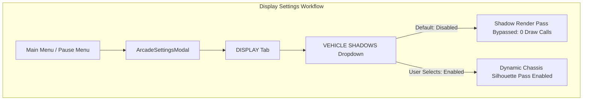

# Feature Spec: Chassis-Conforming Dynamic Vehicle Ground Shadows 🏎️👤🌑

A rendering and visual fidelity specification for **TDRace**, replacing generic rounded rectangular drop shadow boxes with chassis-conforming dynamic ground shadows that faithfully project the authentic silhouette of each vehicle. For sprite-based vehicles, ground shadows project the exact alpha silhouette of the vehicle's top-down sprite; for procedural archetypes, ground shadows project the multi-polygon contour of the bodywork (tapered monocoques, sidepods, aerodynamic wings, and bumpers).

Vehicle shadows are **disabled by default** to guarantee maximum rendering performance and classic arcade visual clarity, while offering high-fidelity, grounded 2.5D visual depth when enabled in Display Settings.

---

## 🗺️ User Flow & Interface Design

### 1. In-Game Visual Experience & Vehicle Grounding
When dynamic vehicle shadows are enabled in Display Settings:
- **Sprite-Based Vehicles (GT, Rally, Stock Cars, Autocross, Karts)**: The ground shadow underneath the vehicle is no longer a generic oblong rounded pill. Instead, it mirrors the exact silhouette of the car bodywork—capturing curved fenders, front splitters, rear wings, cabin glasshouses, and aerodynamic contours.
- **Procedural Archetype Vehicles (Open-Wheel, Prototype, Off-Road Buggies)**:
  - *Open-Wheel / Formula Cars*: Rather than obscuring the asphalt between the nosecone and exposed wheels with a bulky dark box, the shadow conforms to the slender central monocoque, sidepod radiator inlets, rear diffuser, and front/rear aerodynamic wing spans.
  - *Karts*: The shadow hugs the compact tubular frame, front crash bumper, and side protection pods, keeping the exposed tires and driver's cockpit visually open and grounded.
  - *Trophy Trucks & Mud Boggers*: High-clearance off-road vehicles cast a shadow that reflects their flared fenders, cab roofline, and exposed rear spare wheels.
- **Steered Wheel Articulation**: The decoupled steered wheels (Spec 026, 091, 095) continue to cast independent, rotated tire shadows that blend seamlessly with the chassis bodywork shadow.
- **2.5D Elevation & Jump Parallax**: Over crests, jumps, and ramps ($z_{\text{lift}} = z_{\text{jump}} + z_{\text{ramp}}$), the chassis shadow separates directionally from the car along the ambient light vector, softly diffusing and scaling outward while fading in opacity, providing instant spatial altitude cues to the player.

### 2. User Interface & Display Settings
- **Default State**: In all fresh installations, `vehicle_shadows` is `false`.
- **Options Navigation**:
  - In `ArcadeSettingsModal` under the **DISPLAY** tab, the `VEHICLE SHADOWS` dropdown widget offers `Disabled` (default, index 1) and `Enabled` (index 0).
  - Toggling between `Disabled` and `Enabled` immediately applies to in-race rendering without requiring a game restart.
  - Pressing "Restore Defaults" in Settings resets `VEHICLE SHADOWS` to `Disabled`.



---

## ⚙️ Backend Models & API Endpoints

### 1. Dual-Path Silhouette Shadow Pipeline

```mermaid
flowchart LR
    subgraph Current ["Current Shadow Architecture"]
        A1[render_car_with_visual_type_model_and_shadows] --> B1[render_chassis_shadow]
        B1 --> C1["draw_rounded_oriented_chassis (16-vertex rounded rect)"]
        C1 --> D1["Uniform Pill Shadow (Ignores Car Shape)"]
    end

    subgraph Proposed ["Proposed Chassis-Conforming Architecture"]
        A2[render_car_with_visual_type_model_and_shadows] --> B2{shadows_enabled?}
        B2 -->|false (Default)| C2[Skip Shadow Pass completely]
        B2 -->|true| D2{Visual Representation?}
        D2 -->|Top-Down Sprite| E2["render_sprite_chassis_shadow (Alpha Silhouette)"]
        D2 -->|Procedural Archetype| F2["render_archetype_chassis_shadow (Polygon Silhouette)"]
        E2 --> G2["Multi-Layer Penumbra & Directional Ambient Offset"]
        F2 --> G2
    end
```

### 2. Sprite-Based Silhouette Shadow Projection
For vehicles utilizing pre-baked 2D top-down textures (Spec 091/095):
1. **Silhouette Projection**:
   Instead of drawing a rounded geometry box, the renderer draws the top-down sprite texture tinted with pure black and scaled alpha:
   $$\text{Shadow Color} = \text{Color::new}(0.0, 0.0, 0.0, \alpha_{\text{shadow}})$$
2. **Directional Offset & Ambient Light Angle**:
   The shadow is cast on the ground plane at position:
   $$\mathbf{P}_{\text{shadow}} = \mathbf{P}_{\text{car}} + \mathbf{v}_{\text{light\_offset}} + \mathbf{fwd} \cdot d_{\text{geom}}$$
   $$\mathbf{v}_{\text{light\_offset}} = (0.06 + 0.30 \cdot z_{\text{lift}}, 0.08 + 0.40 \cdot z_{\text{lift}})$$
3. **Multi-Layer Ambient Penumbra**:
   - **Outer Penumbra**: Drawn at $(1.04 \cdot \text{scale})$ with faint alpha ($\alpha \approx 0.12 \cdot \alpha_{\text{lift}}$), creating a feathered contact edge.
   - **Inner Umbra Core**: Drawn at exact sprite dimensions with full shadow opacity ($\alpha \approx 0.28 \cdot \alpha_{\text{lift}}$), anchoring the chassis to the tarmac.
4. **Zero Extra Asset Overhead**:
   Uses the existing vehicle texture already loaded in GPU memory—zero additional textures or silhouette masks required on disk.

### 3. Procedural Archetype Silhouette Projection
For vehicles rendered procedurally via `VehicleVisualType`:
1. **Contour Extraction**:
   - `VehicleVisualType::OpenWheel`: Combines the tapered monocoque nosecone, cockpit cowl, sidepods, and front/rear aerodynamic wings into a unified silhouette fill pass.
   - `VehicleVisualType::Kart`: Projects the front tubular bumper, side pods, and floorpan outline.
   - `VehicleVisualType::ProductionGT` / `RallyCross`: Projects the front splitter, widebody wheel arch flares, and rear wing profile.
   - `VehicleVisualType::TrophyTruck` / `Autocross`: Projects the tubular spaceframe perimeter and cab profile.
2. **Layered Drawing**:
   - Outer soft penumbra polygon (inset + slight dilation).
   - Inner core contact occlusion polygon.

### 4. Mathematical Grounding & Elevation Ballistics
Ground shadows react dynamically to suspension compression and airborne ballistics:
- **Ground Altitude ($z_{\text{lift}} = 0$)**:
  $$\text{Scale} = 1.0, \quad \alpha = 1.0, \quad \text{Offset} = (0.06, 0.08)$$
- **Airborne Lift ($z_{\text{lift}} > 0$)**:
  $$\text{Scale}(z_{\text{lift}}) = 1.0 + \min(z_{\text{lift}} \cdot 0.08, 0.40)$$
  $$\alpha(z_{\text{lift}}) = \text{clamp}\left(\frac{1.0}{1.0 + z_{\text{lift}} \cdot 0.55}, 0.25, 1.0\right)$$
  $$\text{Offset}(z_{\text{lift}}) = (0.06 + z_{\text{lift}} \cdot 0.30, 0.08 + z_{\text{lift}} \cdot 0.40)$$

---

## 🛡️ Security & Role-Based Access Controls (RBAC)

1. **Zero Draw Calls When Disabled**:
   When `vehicle_shadows == false` (the default setting), the shadow rendering pipeline is completely bypassed with a single boolean branch check, generating zero OpenGL/Metal draw calls and consuming zero vertex/fill bandwidth.
2. **Texture Memory Budget**:
   Sprite silhouette rendering samples the existing top-down texture already bound or cached for the vehicle body. No duplicate "shadow textures" or precomputed silhouette masks are saved to disk or loaded into RAM.
3. **Headless & Shared Crate Isolation**:
   - Rendering logic resides exclusively within `crates/tdrace-app` (and reusable primitives in `crates/race-ui`).
   - `crates/wheelbase` and `crates/arcade-race-core` remain 100% graphics-free, maintaining determinism and WebAssembly compatibility.
4. **Frame-Rate Target**:
   When enabled, shadow rendering executes in $< 0.15\,\text{ms}$ per vehicle across up to 16 vehicles on screen, maintaining the steady 60 FPS / 120 FPS performance target on low-end hardware and mobile/web targets.

---

## 🧪 Verification & Acceptance Criteria

### Automated Tests
- Verification of default configuration setting across TOML and Rust structs:
  `cargo test -p tdrace-app --test config_tests test_display_config_vehicle_shadows_setting`
- Verification of UI settings state and restore-defaults behavior:
  `cargo test -p cabinet --test cabinet_integration_tests test_arcade_settings_modal_display_tab_integration`
- Verification of vehicle shadow rendering math, elevation scaling, and contour boundaries:
  `cargo test -p tdrace-app --test render_tests`

### Manual Acceptance Criteria (Pseudo-Gherkin)

- **Scenario: Vehicle shadows disabled by default on clean installation**
  - [ ] **Given** a default game configuration without user overrides
  - [ ] **When** the game starts or `DisplayConfig::default()` is evaluated
  - [ ] **Then** `vehicle_shadows` must be `false`
  - [ ] **And** no ground shadows are drawn underneath vehicles during a race

- **Scenario: Toggling vehicle shadows in display settings**
  - [ ] **Given** the player is in the Options menu under the DISPLAY tab
  - [ ] **When** the player changes `VEHICLE SHADOWS` from `Disabled` to `Enabled` and saves
  - [ ] **Then** `vehicle_shadows` must be set to `true`
  - [ ] **And** dynamic chassis ground shadows immediately appear under all race vehicles

- **Scenario: Sprite-based car shadow mirrors top-down chassis silhouette**
  - [ ] **Given** a vehicle rendered with a top-down sprite texture (e.g. GT3 or Rally car)
  - [ ] **And** vehicle shadows are enabled in game settings
  - [ ] **When** the vehicle ground shadow is rendered
  - [ ] **Then** the shadow boundary must match the alpha contour of the car bodywork including wings and splitters
  - [ ] **And** the shadow must not project as a generic rectangular box

- **Scenario: Procedural archetype shadow conforms to archetype geometry**
  - [ ] **Given** a vehicle rendered with procedural archetype geometry (e.g. OpenWheel or Kart)
  - [ ] **And** vehicle shadows are enabled in game settings
  - [ ] **When** the chassis ground shadow is rendered
  - [ ] **Then** the open-wheel shadow must follow the tapered monocoque and wing spans without filling the empty space around exposed wheels
  - [ ] **And** the kart shadow must follow the compact bumper and side pod profile

- **Scenario: Jump elevation lift scales and softens chassis-conforming shadow**
  - [ ] **Given** a vehicle traversing a jump ramp or becoming airborne ($z_{\text{lift}} > 0$)
  - [ ] **And** vehicle shadows are enabled
  - [ ] **When** vehicle elevation increases up to $2.5\,\text{m}$
  - [ ] **Then** the chassis-conforming shadow must scale outward by up to $1.20\times$
  - [ ] **And** the shadow alpha opacity must smoothly fade down to a minimum floor of $0.25$
  - [ ] **And** the shadow projection offset must separate from the vehicle along $(+X, +Y)$

- **Scenario: Restoring settings defaults disables vehicle shadows**
  - [ ] **Given** vehicle shadows are currently enabled by the player
  - [ ] **When** the player clicks "Restore Defaults" in Settings
  - [ ] **Then** `VEHICLE SHADOWS` must revert to `Disabled`
  - [ ] **And** the dropdown selected index must be 1

---

## 🔗 Traceability & Codebase Mapping

| File Path | Description of Changes / Governance |
| :--- | :--- |
| [`crates/tdrace-app/src/render/car.rs`](../crates/tdrace-app/src/render/car.rs) | Replaces generic `draw_rounded_oriented_chassis` with sprite alpha silhouette projection and procedural archetype contour shadow passes. |
| [`crates/tdrace-app/src/config.rs`](../crates/tdrace-app/src/config.rs) | Defines `DisplayConfig::vehicle_shadows` with default set to `false`. |
| [`crates/cabinet/src/state/settings.rs`](../crates/cabinet/src/state/settings.rs) | Configures `ArcadeSettingsModal` `VEHICLE SHADOWS` dropdown widget with default index 1 (`Disabled`). |
| [`config.toml`](../config.toml) | Declares default game display configuration with `vehicle_shadows = false`. |
| [`crates/tdrace-app/tests/render_tests.rs`](../crates/tdrace-app/tests/render_tests.rs) | Validates silhouette shadow geometry, Ackermann wheel synchronization, and elevation scaling. |
| [`crates/tdrace-app/tests/config_tests.rs`](../crates/tdrace-app/tests/config_tests.rs) | Verifies TOML roundtrip and default deserialization of `vehicle_shadows`. |
| [`crates/cabinet/tests/cabinet_integration_tests.rs`](../crates/cabinet/tests/cabinet_integration_tests.rs) | Verifies UI dropdown state, defaults restoration, and toggle interaction in the Display tab. |
| [`specs/constitution/ROADMAP.md`](constitution/ROADMAP.md) | Links Spec 096 under Phase 6: Next-Gen Vehicle Dynamics & Pre-Baked Visual Kinematics. |
