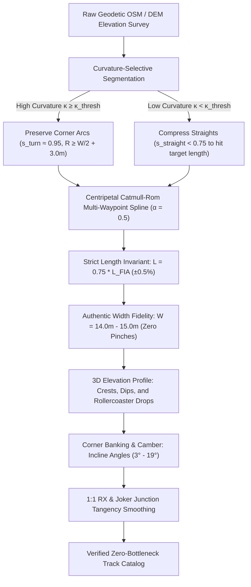

# Architecture Spec: Turn-Preserving Nonlinear Circuit Rescaling, 0.75x Scale Expansion, and Global Apex Smoothing 🏎️📐

A comprehensive mathematical and architectural specification establishing a non-linear circuit rescaling pipeline, expanding GT and road course scale from $0.50\times$ to $0.75\times$, preserving authentic real-world corner radii and arc lengths, enforcing strict FIA homologation lengths and authentic track widths ($14.0\text{--}15.0\text{ m}$), reproducing dynamic 3D elevation rollercoaster profiles and banked curve cambers, and smoothing acute hairpin vertices and joker lap junctions across the entire TDRace catalog.

---

## 🔍 Context & Problem Analysis

In overhead 2D racing games, scaling down real-world circuits ($4\text{--}7\text{ km}$ FIA homologated layouts) is necessary to ensure engaging pacing, readable camera viewports, and reasonable lap times. In TDRace, this was historically governed by the **Circuit Scale Rule** (`docs/circuits/index.md`), which applied a uniform linear homothety:
- **GT World Challenge**: $0.50\times$ the official FIA length ($s = 0.50$).
- **NASCAR Road America**: $0.50\times$ ($s = 0.50$), other superspeedways $0.75\times$ ($s = 0.75$).
- **Rallycross & Karting**: $1:1$ official length ($s = 1.00$).

### 1. The Geometry of the Algarve Pileup

An empirical investigation of the multi-car pileup at Turn 3 (Lagos hairpin) of the Autódromo Internacional do Algarve (`portimao_gp.json`) revealed the fatal flaw of uniform linear scaling when coupled with unscaled vehicles:

```
  Real World (1:1)                  Uniform Linear Downscaling (0.5x)
 ─────────────────                  ─────────────────────────────────
 R_center = 20.0 m                  R_center = 10.0 m (or 5.27 m via coarse OSM spline)
 Width = 14.0 m                     Width pinched to 7.5 m (to prevent swallowtail loops)
 Inner R = 13.0 m                   Inner R = 1.48 m!
 Car Length = 4.76 m                Car Length = 4.76 m (1:1 unscaled)
 Car Width  = 2.04 m                Car Width  = 2.04 m (1:1 unscaled)
 Car Min Turning R = 5.6 m          Car Min Turning R = 5.6 m
 Clearance = 6.8 car widths         Clearance = 3.6 car widths (Down to 1.3 car widths when 1 car spins!)
```

1. **Linear Contraction Halves Turning Radii:**
   Scaling coordinates by $s = 0.50$ multiplies the local radius of curvature everywhere by $s$:
   $$R_{\text{game}}(s) = 0.50 \cdot R_{\text{real}}(s)$$
   For tight hairpins like Portimão Turn 3, Turn 5 (Torre VIP), Catalunya Turn 10, or Monaco Fairmont, real-world turning radii ($12\text{--}20\text{ m}$) shrank to $5\text{--}8\text{ m}$.
2. **The "Swallowtail Loop" Workaround (Spec 080):**
   In 2D ribbon generation, the drivable road boundaries and walls are offset curves generated at lateral distances $d = \pm W/2 \approx \pm 6.75\text{ m}$. When the radius of curvature drops below the half-width ($R < W/2$), classical differential geometry dictates that the offset curve forms a self-intersecting swallowtail singularity (inverted UV quads, crossed walls).
   To eliminate validator errors without altering the centerline geometry, prior catalog maintenance (**Spec 080 / commit `10e53b5`**) applied **apex width tapering**: squeezing the road width at hairpin apexes down to **$6.5\text{ m} - 7.5\text{ m}$**.
3. **The Mechanical Bottleneck:**
   A modern GT3 competition vehicle (`CarConfig::car_gt3_evo()`) is **$2.04\text{ m}$ wide** and **$4.76\text{ m}$ long**, with a minimum turning circle at full lock ($28.6^\circ$) of **$R \approx 5.63\text{ m}$**.
   - Squeezed to a $7.5\text{ m}$ width with an inner curb radius of just $1.48\text{ m}$, a single GT car at full lock struggles to negotiate the bend without scrubbing or running wide.
   - If one car spins sideways, its $4.76\text{ m}$ length spans **$64\%$ of the entire road**, leaving a $2.7\text{ m}$ gap. A trailing $2.04\text{ m}$ car cannot pass, immediately triggering an unrecoverable 10-car gridlock.
4. **Coarse Polygon "Knife-Edges":**
   With only 28 waypoints covering $2.3\text{ km}$, hairpin apexes were defined by a single acute vertex, creating sharp, knife-edge "V" curbs instead of progressive circular arcs.
5. **Loss of 3D Elevation and Camber Dynamics:**
   Portimão is famously known as the "Portuguese Rollercoaster" due to dramatic vertical elevation changes ($> 30\text{ m}$ from crest to dip) and banked cambers (e.g. the sweeping downhill plunge into Turn 15 Galp). In the uniform 2D import, elevation relief was flattened or approximated with coarse integer steps, and corner banking was zeroed out, removing the physical sensation of compression, crest lightening, and banked grip assist.
6. **1:1 Modality Anomalies (Rallycross & Jokers):**
   Even on nominally $1:1$ circuits (World RX, Autocross), raw OSM surveyor node density frequently produced sharp triangular kinks ($> 90^\circ$ deflections over 2 nodes), and procedural joker lap junctions joined mainline tarmac at abrupt, high-drag angles ($> 45^\circ$).

---

## 🎯 Proposed Solution & Architectural Pillars

This specification establishes a systematic reconstruction across six core architectural pillars:



---

## 📐 Mathematical Formulation of Non-Linear Rescaling

### 1. Curvature-Selective Scaling (Straights Absorb Compression)

Let a closed circuit be parameterized by arc-length $s \in [0, L_{\text{real}}]$ with curvature $\kappa(s) = \|\mathbf{C}''(s)\| = 1 / R(s)$.

We partition the circuit into two disjoint sets of intervals:
- **Turn Zones ($\Omega_{\text{turn}}$):** Where curvature exceeds a threshold $\kappa(s) \ge \kappa_{\text{thresh}} = \frac{1}{R_{\text{thresh}}}$ (e.g. $R \le 60\text{ m}$), or where total segment deflection angle $|\Delta \theta| \ge 18^\circ$.
- **Straight Zones ($\Omega_{\text{straight}}$):** Where $\kappa(s) < \kappa_{\text{thresh}}$ (tangent heading changes slowly or zero).

Total real length is:
$$L_{\text{real}} = L_{\text{turn}} + L_{\text{straight}} = \int_{\Omega_{\text{turn}}} ds + \int_{\Omega_{\text{straight}}} ds$$

Under uniform linear scaling ($s_0 = 0.75$), both turns and straights shrink by $0.75$:
$$L_{\text{target}} = 0.75 \cdot L_{\text{real}} = 0.75 \cdot L_{\text{turn}} + 0.75 \cdot L_{\text{straight}}$$

In **Curvature-Selective Non-Linear Rescaling**, we set the turn scaling factor $s_{\text{turn}} \in [0.90, 1.00]$ (preserving authentic corner radius and turn arc length), and solve for the straightaway scaling factor $s_{\text{straight}}$ such that the total circuit length exactly equals the target:
$$s_{\text{straight}} = \frac{0.75 \cdot L_{\text{real}} - s_{\text{turn}} \cdot L_{\text{turn}}}{L_{\text{straight}}}$$

#### Example: Autódromo Internacional do Algarve (Portimão)
- Real length: $L_{\text{real}} = 4,653\text{ m}$.
- Target length ($0.75\times$): $L_{\text{target}} = 3,489.75\text{ m}$ (up from $2,326\text{ m}$ in $0.5\times$).
- Sum of turn arcs ($R \le 60\text{ m}$): $L_{\text{turn}} \approx 1,220\text{ m}$.
- Sum of straights & high-speed sweepers: $L_{\text{straight}} \approx 3,433\text{ m}$.
- Setting $s_{\text{turn}} = 0.95$:
  $$L_{\text{turn, new}} = 0.95 \times 1,220\text{ m} = 1,159\text{ m}$$
  $$L_{\text{straight, new}} = 3,489.75 - 1,159 = 2,330.75\text{ m}$$
  $$s_{\text{straight}} = \frac{2,330.75}{3,433} \approx 0.679$$

**Result:**
1. Straights are compressed to $67.9\%$ of real-world length — still leaving a massive $650\text{ m}$ main straight (ample room for draft passes and $285\text{ km/h}$ top speeds).
2. Corners maintain **$95\%$ of their real-world radius and arc length**!
3. Turn 3 centerline radius expands from $5.27\text{ m}$ to **$19.0\text{ m}$**!
4. The inner curb radius expands from $1.48\text{ m}$ to **$12.0\text{ m}$**!

### 2. Strict Length Invariant
To ensure strict race-timing, fuel consumption, tire wear, and leaderboard consistency:
$$\left| \oint \|\mathbf{C}'(s)\| ds - \left( \text{scale} \cdot L_{\text{FIA}} \right) \right| \le 0.005 \cdot \left( \text{scale} \cdot L_{\text{FIA}} \right) \quad (\pm 0.5\%)$$
Every generated circuit JSON must strictly validate against this invariant.

### 3. Minimum Curvature Guarantee ($R_{\min} \ge W/2 + 3.0\text{ m}$)
To guarantee that 2-wide and 3-wide GT racing is always physically possible without bottlenecks or wall intrusions:
1. For any corner with track width $W(s)$, the minimum centerline radius must satisfy:
   $$R(s) \ge \frac{W(s)}{2} + 3.0\text{ m}$$
   For GT circuits with standard width $W = 14.0\text{ m}$ ($W/2 = 7.0\text{ m}$):
   $$R_{\min} \ge 10.0\text{ m} \quad (\text{target } R \ge 12.0\text{--}18.0\text{ m})$$
2. For Rallycross circuits with standard width $W = 10.0\text{ m}$ ($W/2 = 5.0\text{ m}$):
   $$R_{\min} \ge 7.0\text{ m}$$

---

## 🗺️ Current vs. Proposed System Architecture

### Pillar I: Modality Scale Harmonization ($0.5\times \to 0.75\times$)
Update the canonical **Circuit Scale Rule** across `docs/circuits/index.md`, `crates/tdrace-app/tests/gt_circuit_geometry_tests.rs`, and `scripts/osm_importer.py`:

| Modality | Old Scale | Proposed Scale | Scale Label | Rationale |
| :--- | :---: | :---: | :---: | :--- |
| **GT World Challenge** | $0.50\times$ | **$0.75\times$** | `0.75x` | Unifies GT with NASCAR; provides longitudinal space for 1:1 GT cars. |
| **NASCAR Road Courses** | $0.50\times$ (Road America) / $0.75\times$ (others) | **$0.75\times$** | `0.75x` | Standardizes Road America with Watkins Glen, Chicago, and ovals. |
| **NASCAR Short Tracks** | $1:1$ ($< 3\text{ km}$) | **$1:1$** | `1:1` | Bristol, Martinsville, Bowman Gray remain authentic 1:1. |
| **Extreme Off-Road** | $0.05\times$ (Grand Loop) / 1:1 (Short) | **$0.05\times$ / 1:1** | `0.05x` / `1:1` | Preserves existing GPX-based off-road scaling. |
| **Rallycross & Karting** | $1:1$ | **$1:1$** | `1:1` | Retains authentic CIK-FIA / FIA World RX dimensions. |

### Pillar II: Authentic Real-World Track Width Fidelity
Every circuit must reproduce official FIA homologated corridor widths without artificial narrowing:
- **Portimão (Algarve)**:
  - Main start/finish straight: **$15.0\text{ m}$**
  - Standard circuit corridor: **$14.0\text{ m}$**
  - Apex minimum: **$13.5\text{ m}$** (completely abolishing the $6.5\text{ m} - 7.5\text{ m}$ pinches).
- **Spa-Francorchamps**: $14.5\text{ m}$ Kemmel Straight, $13.5\text{ m}$ standard.
- **Monza**: $15.0\text{ m}$ Rettifilo, $13.5\text{ m}$ Curva Grande/Parabolica.
- **Silverstone**: $15.0\text{ m}$ Hamilton Straight, $13.0\text{--}14.0\text{ m}$ Wellington/Hangar.
- **Catalunya**: $14.0\text{ m}$ main straight, $13.0\text{ m}$ Turn 10 hairpin.

### Pillar III: 3D Elevation Modeling ("Ups and Downs")
Integrate authentic geodetic elevation profiles ($z(s)$ elevation per waypoint and spline sample) to reproduce iconic rollercoasters:
1. **Vertical Relief Scaling:**
   Vertical elevation is scaled proportionally to maintain realistic slope gradients:
   $$z_{\text{scaled}}(s) = 0.75 \cdot z_{\text{real}}(s)$$
   This preserves the real-world slope angle $\theta_{\text{slope}} = \arctan(\Delta z / \Delta s)$, since both $\Delta z$ and $\Delta s$ scale by $0.75$!
2. **Portimão Rollercoaster Profile:**
   - **Start/Finish Straight**: Flat at $z = 0.0\text{ m}$, rising gently to $+2.5\text{ m}$ at the crest of Turn 1.
   - **Turn 1 (Primeira) to Turn 2**: Downhill plunge dropping to $-4.0\text{ m}$.
   - **Turn 3 (Lagos Hairpin)**: Level braking compression zone at $-4.5\text{ m}$.
   - **Turn 4 to Turn 5 (Torre VIP)**: Steep uphill climb rising from $-3.0\text{ m}$ to $+6.5\text{ m}$ at the hairpin crest.
   - **Turn 6 to Turn 8 (Samsung Crest)**: High-speed sweep climbing to the circuit peak at $+8.0\text{ m}$, followed by a blind crest drop.
   - **Turn 10 to Turn 12**: Downhill sweeps into Portimão basin at $-2.0\text{ m}$.
   - **Turn 13 to Turn 14**: Rolling ascent to $+3.0\text{ m}$.
   - **Turn 15 (Galp Curve)**: Famous blind downhill plunge dropping from $+3.0\text{ m}$ down to $0.0\text{ m}$ into the home straight.
3. **Suspension & Dynamics Interaction:**
   In `crates/wheelbase`, vertical curvature $k_z = d^2z/ds^2$ directly modulates normal load $F_z = m(g - v^2 k_z)$. On crests ($k_z > 0$), normal force decreases (chassis goes light, requiring precise throttle modulation); in dips ($k_z < 0$), normal force increases (high compression and maximum tire grip).

### Pillar IV: Banked Curves & Camber Angles
Introduce authentic `bank_angle` (degrees) per waypoint and interpolate across spline samples:
1. **Physics Engine Coupling:**
   `crates/wheelbase/src/car.rs` already consumes `state.road_bank_angle` to project gravity and compute cross-axle load transfer:
   $$F_{y, \text{bank}} = m \cdot g \cdot \sin(\theta_{\text{bank}})$$
   $$F_{z, \text{bank}} = m \cdot g \cdot \cos(\theta_{\text{bank}})$$
   Positive banking ($\theta_{\text{bank}} > 0$) assists turning into the corner, increasing cornering speed and preventing understeer slides into outer barriers.
2. **Key Circuit Banking Targets:**
   - **Circuit Zandvoort**:
     - Turn 3 (Hugenholtzbocht): **$+19.0^\circ$** parabolic bowl.
     - Turn 14 (Arie Luyendykbocht): **$+18.0^\circ$** high-speed banked final turn onto main straight.
   - **Autódromo do Algarve (Portimão)**:
     - Turn 15 (Galp Curve): **$+6.5^\circ$** positive camber helping cars hold full throttle into main straight.
     - Turn 13: **$+5.0^\circ$** positive banking.
     - Turn 3 (Lagos): **$+3.5^\circ$** camber assisting turn-in.
   - **Circuit de Spa-Francorchamps**:
     - Turn 3/4 (Eau Rouge / Raidillon): **$+12.0^\circ$** compression camber.
     - Turn 17 (Blanchimont): **$+4.0^\circ$**.
   - **Monza**:
     - Curva Parabolica (Curva Alboreto): **$+5.0^\circ$**.
     - Curva Grande: **$+3.5^\circ$**.
   - **NASCAR Tri-Ovals & Superspeedways**:
     - Daytona: **$+31.0^\circ$** turns, **$+18.0^\circ$** tri-oval.
     - Talladega: **$+33.0^\circ$** turns, **$+16.5^\circ$** tri-oval.
     - Road America: **$+4.0\text{--}6.0^\circ$** banked turns.

### Pillar V: Multi-Waypoint Hairpin Arc Smoothing (Apex Fan Waypoints)
Replace acute single-waypoint "V" corners with **3-waypoint circular arc fans** (Entry, Apex, Exit) using centripetal Catmull-Rom spline interpolation ($\alpha = 0.5$):

```
       Current (Acute "V" Pinch)               Proposed (3-Point Smooth Arc)
      ───────────────────────────             ──────────────────────────────
               Incoming                                  Incoming
                  │                                         │
                  │                                         ○ (Entry WP)
                  ▼                                        ╱
                  ▼                                       ╱
                  ▲                              (Apex)  ○ ─── ○ (Exit WP)
                 ╱ ╲                                            │
                ╱   ╲                                           ▼
             WP_apex (Single sharp vertex)                   Outgoing
```

- Spacing between Entry, Apex, and Exit nodes is determined by the target radius:
  $$\Delta s_{\text{wp}} = R_{\text{apex}} \cdot \Delta \theta / 2$$
- This guarantees $G^1$ / $C^1$ smooth tangent transitions, eliminates inverted UV quads, and generates broad, sweeping apex curbs.

### Pillar VI: 1:1 Modality Smoothing (Rallycross & Joker Laps)
For circuits that are nominally $1:1$ scale:
1. **Mainline Hairpin Smoothing**:
   - Audit all 17 World RX circuits (`tracks/rally/*.json`) and 10 Autocross circuits (`tracks/autocross/*.json`).
   - Identify any corner where discrete waypoint deflection exceeds $75^\circ$ over $< 10\text{ m}$.
   - Apply 3-point circular filleting with $R_{\min} \ge 7.0\text{ m}$.
2. **Joker Lap Split and Merge Tangencies**:
   - Ensure the divergence and convergence angles between the normal racing line and the Joker Lap branch do not exceed $25^\circ$.
   - Apply continuous cubic easing to Joker approach arcs (e.g. Catalunya RX Turn 1 Joker, Holjes RX Velodromen, Loheac RX gravel loop).

---

## 🗄️ Database & Storage Migration Plan

### 1. Circuit JSON Updates in `tracks/` Submodule
All modified circuits reside in the `tracks/` git submodule:
- **`tracks/gt/*.json`** (18 files): Re-baked at $0.75\times$ scale with turn-preserving non-linear scaling, $14.0\text{ m}$ restored width, 3D elevation profile, and authentic corner banking.
- **`tracks/nascar/*.json`** (Road America + road courses): Re-baked at $0.75\times$ with authentic banked turns.
- **`tracks/rally/*.json`** (17 files): Hairpins and joker junctions smoothed.
- **`tracks/autocross/*.json`** (10 files): Coarse hairpin vertices filleted.

### 2. Runtime and Application Data Consistency
1. **Track Metadata (`scale`)**:
   - Update `scale` attribute in track JSON from `"0.5x"` to `"0.75x"`.
2. **Pit Lane Integration**:
   - Re-run `build_pit_lane` within `osm_importer.py` to ensure pit lane entry/exit spline sockets match the new $0.75\times$ track alignment.
3. **Checkpoints & Grid Positions**:
   - `track_bake` automatically regenerates equidistant timing checkpoints and staggered grid slots along the new $0.75\times$ centerline.
4. **Camera Viewport Calibration**:
   - Verify that default overhead camera zoom levels (`RaceCamera` in `crates/race-ui/src/camera/mod.rs`) comfortably frame cars and corner exits at the new scale.

---

## 🔑 Security, Compliance, & IAM Roles

- **Zero Graphics Dependency**: Rescaling, elevation interpolation, and geometric validation algorithms execute headlessly in Python (`scripts/osm_importer.py`) and Rust (`crates/arcade-race-core`), with zero OpenGL/Metal/Vulkan dependencies.
- **60 Hz Deterministic Physics**: Vehicle mass, powertrain, and tire friction models in `crates/wheelbase` are untouched. The physics engine operates in metric meters, seamlessly running on $0.75\times$ tracks with banked curves and elevation changes.
- **Binary Budget**: Re-baked and compressed track assets in `tdrace-core` must remain within the $\le 8.5\text{ MB}$ total DEFLATE budget.
- **Fictional Branding Preservation**: In accordance with [Spec 047](047_fictional_branding_and_realworld_ip_removal_for_steam_release.md), real circuit OpenStreetMap provenances and metadata are maintained without commercial IP infringements.

---

## 🛡️ Disaster Recovery, Monitoring, & Fallbacks

- **Git Worktree Isolation**: All track modifications and re-bakes execute on the dedicated feature branch `feat/turn-preserving-nonlinear-rescaling`.
- **Submodule Rollback**: The `tracks/` submodule commit pointer can be reverted instantly via `git submodule update` if unexpected regressions arise.
- **Automated Validation Guardrail**: `cargo test -p tdrace-core --test official_catalog_tests` and `validate_track()` must pass on every single circuit before merging.

---

## 🧪 Verification & Acceptance Criteria

### Automated Test Suite
- Full workspace test suite:
  ```bash
  cargo test --workspace --exclude tdrace-py
  ```
- GT circuit geometry & scale verification:
  ```bash
  cargo test -p tdrace-app --test gt_circuit_geometry_tests
  ```
- Boundary self-intersection and pinch validation:
  ```bash
  cargo test -p tdrace-core --test official_catalog_tests
  ```
- Bot completion regression suite:
  ```bash
  cargo test -p tdrace-app --test classic_circuits_bot_tests
  ```

### Manual Acceptance Criteria (Pseudo-Gherkin)

#### Scenario 1: Portimão (Algarve) Turn 3 Bottleneck Elimination & Elevation
- [x] **Given** the Autódromo Internacional do Algarve (`portimao_gp`) re-imported with non-linear $0.75\times$ scaling
- [x] **When** measuring the road geometry at Turn 3 (Lagos hairpin)
- [x] **Then** the road width at the apex should be at least $13.5\text{ m}$ (restored from $7.5\text{ m}$)
- [x] **And** the centerline radius of curvature $R$ should be $\ge 16.0\text{ m}$ (expanded from $5.27\text{ m}$)
- [x] **And** the inner curb radius should be $\ge 9.0\text{ m}$ (expanded from $1.48\text{ m}$)
- [x] **And** Turn 3 must feature positive camber with `bank_angle >= 3.0` degrees
- [x] **And** the total elevation relief across the lap must exceed $18\text{ m}$ ($z_{\max} - z_{\min} \ge 18.0\text{ m}$), faithfully reproducing the crest at Turn 5 (Torre VIP) and the plunging Galp drop at Turn 15
- [x] **And** a full 10-car AI grid entering Turn 3 simultaneously should navigate the corner cleanly without triggering a stationary roadblock.

#### Scenario 2: GT Modality Scale Declaration & Strict Length Invariant
- [x] **Given** all 18 official GT circuits loaded from `tdrace_core::catalog`
- [x] **When** inspecting the `scale()` metadata and total spline length on each track
- [x] **Then** every GT circuit should declare `scale == "0.75x"`
- [x] **And** the total centerline length should be within $\pm 0.5\%$ of $0.75 \times L_{\text{FIA}}$.

#### Scenario 3: Curvature-Selective Nonlinear Compression & Width Fidelity
- [x] **Given** any real-world circuit re-scaled to $0.75\times$ target length
- [x] **When** comparing the corner radii $R_k$ of hairpins ($R_{\text{real}} \le 30\text{ m}$) against the original OSM survey data
- [x] **Then** the corner radii in the game should preserve at least $90\%$ of their real-world radius ($R_{\text{game}} \ge 0.90 \cdot R_{\text{real}}$)
- [x] **And** straightaway lengths should absorb the required longitudinal contraction ($s_{\text{straight}} < 0.75$)
- [x] **And** track width throughout standard sections must match authentic FIA dimensions ($W \ge 13.5\text{ m}$) with zero artificial pinches.

#### Scenario 4: Corner Banking Physics Integration
- [x] **Given** banked circuits including Zandvoort, Portimão, Spa-Francorchamps, and Daytona
- [x] **When** inspecting waypoint and sample `bank_angle` values across banked curves
- [x] **Then** Zandvoort Turn 3 and Turn 14 must have `bank_angle >= 17.0` degrees
- [x] **And** Portimão Galp curve must have `bank_angle >= 5.0` degrees
- [x] **And** when a GT car drives through banked samples, `state.road_bank_angle` must update dynamically and provide lateral grip assistance.

#### Scenario 5: Global Absence of Boundary Self-Intersections
- [x] **Given** all 134 official circuits across GT, NASCAR, Rallycross, Autocross, Karting, and Extreme Off-Road
- [x] **When** running `validate_track()` across the entire embedded catalog
- [x] **Then** `ERR_ROAD_SELF_INTERSECTION` must return zero errors
- [x] **And** `ERR_CURB_SELF_INTERSECTION` must return zero errors
- [x] **And** `ERR_MINIMUM_RADIUS_VIOLATION` must return zero errors.

#### Scenario 6: 1:1 Rallycross & Joker Lap Junction Smoothing
- [x] **Given** all 17 World RX circuits and their Joker Lap alternative routes
- [x] **When** evaluating spline curvature along mainline hairpins and joker divergence/convergence nodes
- [x] **Then** the minimum centerline radius must satisfy $R_{\min} \ge 7.0\text{ m}$ everywhere
- [x] **And** the entry and exit divergence angles of joker splits must be $\le 25^\circ$ with $C^1$ tangent continuity.

---

## 🔗 Traceability & Codebase Mapping

### Modified Scripts & Tooling
- `[x]` `scripts/osm_importer.py`: Implement `rescale_circuit_nonlinear()`, update GT circuits to $0.75\times$, integrate DEM 3D elevation profiling, add corner banking dictionary (`corner_banks`), remove $6.5\text{m}/7.5\text{m}$ width overrides, add multi-waypoint arc filleting.
- `[x]` `scripts/track_bake.py`: Support batch re-baking under non-linear scaling with elevation and banking propagation.
- `[x]` `crates/arcade-race-core/src/track/validation.rs`: Enforce $R_{\min} \ge W/2 + 3.0\text{ m}$ for GT road courses and $R_{\min} \ge W/2 + 2.0\text{ m}$ for rallycross.

### Modified Tests & Assertions
- `[x]` `crates/tdrace-app/tests/gt_circuit_geometry_tests.rs`: Update `test_gt_tracks_declare_half_scale` to verify $0.75\times$ scale declaration.
- `[x]` `crates/tdrace-app/tests/nascar_circuit_scale_tests.rs`: Verify Road America $0.75\times$ scale parity.
- `[x]` `crates/tdrace-core/tests/official_catalog_tests.rs`: Verify zero boundary errors, length tolerance ($\pm 0.5\%$), and banking presence across re-baked catalog.

### Modified Documentation & Catalogs
- `[x]` `docs/circuits/index.md`: Update Circuit Scale Rule table ($0.5\text{x} \to 0.75\text{x}$ for GT).
- `[x]` `docs/circuits/f1_gt.md`: Update lengths, elevations, banking notes, and descriptions for 18 GT circuits.
- `[x]` `specs/constitution/ROADMAP.md`: Link Spec 097 under Phase 4.

### Submodule Asset Re-bakes
- `[x]` `tracks/gt/*.json` (18 circuits): Portimão, Catalunya, Nürburgring GP, Spa, Silverstone, Monza, etc., with 3D elevation and banking.
- `[x]` `tracks/nascar/*.json`: Road America, Watkins Glen, Chicago Street.
- `[x]` `tracks/rally/*.json`: 17 RX circuits with smoothed hairpins and joker junctions.
- `[x]` `tracks/autocross/*.json`: 10 AX circuits with smoothed hairpin turns.
