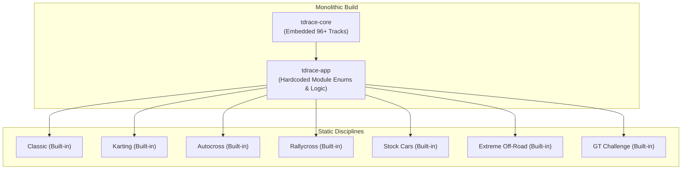

# Architecture Spec 100: DLC Architecture and Modular Base Game Content Packaging 🏗️

TdRace is preparing for its commercial release on Steam. Today, all motorsport disciplines, vehicles, audio profiles, and 96+ circuits are compiled directly into a monolithic binary and unconditionally unlocked. This architecture makes it impossible to ship a focused base game and sell subsequent expansions as Steam Downloadable Content (DLC).

This specification establishes a **modular DLC architecture** that:
1. Defines the **Initial Steam Base Game**: **Classic Arcade + Grassroots Karting + FIA Autocross + Rallycross**, organized along an authentic motorsport license ladder (`Karting [License D] -> Autocross [License C] -> Rallycross [License B]`).
2. Isolates future disciplines (**Stock Cars**, **Extreme Off-Road**, and **GT World Challenge**) as **Expansion DLCs**.
3. Decouples hardcoded module dispatch into an extensible, metadata-driven `ModuleManager` and `ContentRegistry`.
4. Introduces the `EntitlementProvider` abstraction for clean Steamworks SDK integration (`steamworks-rs`) with headless/offline development parity.
5. Enforces a **Strict Zero-Clutter Base Game UI**: Unconfirmed or unreleased DLCs (GT, Stock Cars, Extreme Off-Road) do NOT appear in the UI at base release, presenting a cohesive, complete, and self-contained 4-discipline game without locked placeholders or premature teasers.

---

## 🗺️ Current vs. Proposed System Architecture

### 1. Current Architecture

Currently, `tdrace` operates as a compile-time monolith:
* **Embedded Circuit Monolith**: `crates/tdrace-core/build.rs` scans `tracks/` and compiles all 96+ circuit JSON files into `CIRCUITS: &[EmbeddedCircuit]` using `include_bytes!` (Spec 042). Every track from every discipline is baked into the main binary.
* **Hardcoded Module Switchboard**: `crates/tdrace-app/src/module/mod.rs` and `crates/tdrace-app/src/game/mod.rs` maintain hardcoded functions (`switch_to_gt()`, `switch_to_kart()`, `switch_to_nascar()`, etc.) and exhaustive matches.
* **Uniform UI Presentation**: The Modality Selector and Career Hub treat all disciplines as permanently owned and unlocked, with no concept of content entitlement, store linking, or commercial packaging.



---

### 2. Proposed Architecture

The proposed architecture cleanly separates the **Core Base Game** from **Expansion DLCs**, routing all module access through a central `ModuleManager` backed by an `EntitlementProvider`.

```mermaid
flowchart TD
    subgraph Steam Ecosystem / OS Environment
        SteamClient["Steam Client / Steamworks API"]
        LocalEnv["Local Dev / Offline Fallback"]
    end

    subgraph Platform Abstraction Layer
        EP["trait EntitlementProvider<br/>• is_dlc_installed(app_id)<br/>• open_store_page(app_id)"]
        SEP["SteamEntitlementProvider<br/>(steamworks::Client)"]
        DEP["DevEntitlementProvider<br/>(Auto-unlock all)"]
    end

    SteamClient --> SEP
    LocalEnv --> DEP
    SEP & DEP -.-> EP

    subgraph Game Runtime
        MM["ModuleManager & ContentRegistry"]
        EP --> MM

        subgraph Base Game (Included)
            B_Classic["Classic Academy & Arcade"]
            B_Kart["Grassroots Karting (License D)"]
            B_AX["FIA Autocross (License C)"]
            B_RX["Rallycross (License B)"]
        end

        subgraph Expansion DLCs (Gated)
            D_Stock["Stock Car Cup (DLC AppID: TBD)"]
            D_Offroad["Extreme Off-Road (DLC AppID: TBD)"]
            D_GT["GT & Prototypes (DLC AppID: TBD)"]
        end

        MM --> B_Classic & B_Kart & B_AX & B_RX
        MM -->|Entitled| D_Stock & D_Offroad & D_GT
        MM -->|Unowned| Showcase["Interactive Turntable Teaser<br/>+ [View on Steam Store]"]
    end
```

---

## 📦 Content Packaging & License Progression

### 1. Base Game Roster (Initial Steam Release)

The initial base game focuses on the **tactical sweet spot of top-down arcade racing**: agile handling, surface friction transitions (asphalt to dirt), chicanes, and bumper-to-bumper pack racing.

| Discipline | Identifier | Career License | Key Focus & Physics Characteristics | Content Volume |
| :--- | :--- | :--- | :--- | :--- |
| **Classic Arcade** | `classic` | Academy Starter | Pickup-and-play arcade fantasy racing, driving academy tutorials, credit seed fund. | 18 Circuits, 12 Cars |
| **Grassroots Karting** | `kart` | **License D** (National C) | Ultra-direct steering, caster-jacking inside wheel lift, high lateral Gs, zero downforce. | 20 Circuits, 6 Tiers |
| **FIA Autocross** | `autocross` | **License C** (National B) | Pure loose dirt racing, buggy counter-steering, sprint heats, 4WD cross cars. | 17 Circuits, 5 Tiers |
| **Rallycross** | `rally` | **License B** (National A) | Mixed asphalt/gravel transitions, 600 BHP launch acceleration, Joker Lap strategy. | 20 Circuits, 6 Tiers |

#### The Natural Progression Flow:
* **Onboarding**: Player completes Classic Academy missions or starter races to acquire driving license D.
* **Tier 1 (License D - Grassroots)**: Grassroots Karting teaches racing lines, late braking, and weight transfer.
* **Tier 2 (License C - Clubman Dirt)**: FIA Autocross challenges players to master low-grip dirt steering and slide recovery.
* **Tier 3 (License B - Pro-Am All-Terrain)**: Rallycross combines high horsepower with hybrid asphalt/dirt tracks and mandatory Joker Lap tactical decisions.
* **Tier 4 (License A - Apex Superlicense)**: GT World Challenge is reserved for master drivers, introducing realistic tactical and endurance constraints:
  * **Mandatory Damage Model Active (Spec 078)**: Full mechanical durability, directional impact masking, suspension failure, and engine placement vulnerability are strictly active; unlike lower grassroots tiers, collisions inflict cumulative physical and handling degradation.
  * **Mandatory Pit Lane & Pit Stall Stops (Specs 062 & 077)**: Races require navigating speed-limited pit entry/exit corridors to execute active 2–3s pit stops for:
    * **In-Race Vehicle Repairs**: Repairing front/side collision damage and suspension misalignment.
    * **Tyre Changing & Compound Strategy (Spec 098)**: Changing worn tyres and adapting compound selection (Soft, Medium, or Hard slicks) to offset thermal degradation and grip loss.
  * **Aerodynamic High-Downforce Dynamics**: High top speeds and sensitive aerodynamic balance where body damage drastically diminishes downforce and cornering authority.

---

### 2. Expansion DLC Modules

Future DLCs act as **Lateral Career Specializations** or **Prestige Superlicense Expansions**:

| DLC Expansion | Identifier | Type | Career License | Role & Description |
| :--- | :--- | :--- | :--- | :--- |
| **Stock Car Cup** | `nascar` | Lateral Specialization | Oval License | 5 tiers of high-speed oval drafting, aerodynamic slingshotting, stage racing, and superspeedways (Daytona, Talladega). |
| **Extreme Off-Road** | `extreme_offroad` | Lateral Specialization | Off-Road License | Desert sand dunes, rock crawls, mud bogs, and stadium stunt arenas with massive jump ramps. |
| **GT World Challenge** | `gt` | Prestige Expansion | **License A** (Superlicense) | High-downforce endurance GT3/GT1/Hypercar racing with mandatory damage modeling, speed-limited pit lanes, and pit stall stops for in-race repairs and tyre changes. |

---

### 3. Cross-Module DLC Content Injection (GT World Challenge & Classic Academy)

DLC expansions are not restricted to isolated silos. When an expansion is installed, it can inject specialized content into the base game to enrich the core experience:

#### A. Bonus Extended Classic Endurance Circuits (with Pit Lanes)
Base game Classic circuits ([Spec 055](055_classic_circuits_revamp.md)) focus on short, intense sprint racing without pit stops (`pit_box_area: null`). Installing the **GT World Challenge DLC** injects **two extended endurance layouts** directly into the Classic module:
1. `classic_velocity_endurance`: An extended 2.4 km configuration of Velocity Park featuring high-speed sweeping curves, a long pit straight, speed-limited pit entry/exit corridors, and a fully functional 12-stall pit box lane.
2. `classic_grand_prix_24h`: A 2.8 km premier endurance ribbon combining high-downforce technical complexes with an authentic multi-stall pit lane.

These tracks allow players to experience endurance racing and pit stop strategy using the free Classic fantasy cars (e.g. `classic_apex_phantom_gt`) before entering career championships.

#### B. Classic Academy Tier 4 "Superlicense Masterclass" Injection (Spec 064 Harmonization)
In the Base Game, the Classic Driving Academy ([Spec 060](060_classic_academy_and_grassroots_career_onboarding.md), [Spec 064](064_classic_module_multitier_academy_missions_and_degradation_curriculum.md)) covers Tiers 1–3, awarding National Racing Licenses up to License B:
* **Tier 1 (License D - Grassroots)**: Apex precision and threshold braking.
* **Tier 2 (License C - Clubman Dirt)**: Dirt drifts and loose surface weight transfer.
* **Tier 3 (License B - Pro-Am All-Terrain)**: Tire thermal discipline and throttle modulation.

When the **GT World Challenge DLC** is installed, it dynamically registers and unlocks **Tier 4: Superlicense Masterclass** in the Classic Academy:
* **Lesson 4.1 (`acad_4_1`) - Pit Lane Entry & Speed Limiter**: Practice approaching the pit lane at high speed, engaging the pit limiter, and executing a clean 2.5s pit box stop on `classic_velocity_endurance`.
* **Lesson 4.2 (`acad_4_2`) - Mechanical Preservation in Heavy Traffic**: Multi-lap race in traffic teaching clean overtaking to avoid body contact and suspension failure ([Spec 078](078_directional_impact_masking_engine_placement_damage_and_archetype_suspension_failure.md)).
* **Lesson 4.3 (`acad_4_3`) - The Tactical Undercut & Tire Compound Swap**: Executing an early pit stop on Lap 3 to switch from worn rubber to fresh Soft slicks ([Spec 098](098_gt_tyre_compound_choice_in_the_garage.md)) and setting an aggressive out-lap to jump the leader.
* **Lesson 4.4 (`acad_4_4`) - Superlicense Graduation Endurance**: An 8-lap endurance championship on `classic_grand_prix_24h` with mandatory mechanical damage, accelerated tire wear, and mandatory pit stop strategy.

Completing Tier 4 awards the **Class A Apex Superlicense**, formally unlocking the professional GT World Challenge career series.

---

## 🛠️ Detailed Component Architecture

### 1. The `EntitlementProvider` Abstraction

To ensure that the game runs seamlessly in continuous integration, local testing, headless simulation harnesses, and on Steam, entitlement queries are encapsulated behind a trait:

```rust
pub trait EntitlementProvider: Send + Sync {
    /// Checks whether the user owns and has installed the specified DLC.
    fn is_dlc_installed(&self, steam_app_id: u32) -> bool;

    /// Activates the platform store page / overlay for the DLC.
    fn open_store_page(&self, steam_app_id: u32);

    /// Name of the provider for telemetry and logging.
    fn provider_name(&self) -> &'static str;
}
```

#### Provider Implementations:
1. **`SteamEntitlementProvider`** (`crates/tdrace-app/src/platform/steam.rs`):
   * Compiled under `#[cfg(feature = "steam")]`.
   * Initializes `steamworks::Client::init_app(BASE_APP_ID)`.
   * Calls `client.apps().is_dlc_installed(steam_app_id)`.
   * Calls `client.friends().activate_game_overlay_to_store(steam_app_id, OverlayToStoreFlag::None)`.
2. **`DevEntitlementProvider`** (`crates/tdrace-app/src/platform/dev.rs`):
   * Default implementation for `cargo run`, `cargo test`, and builds without the `steam` feature.
   * Unconditionally returns `true` for all DLC IDs, allowing development and testing of all content without requiring a running Steam client or purchased licenses.
3. **`MockEntitlementProvider`**:
   * Configurable set of active DLC IDs for unit and UI testing of locked/unlocked states.

---

### 2. The `ModuleManager` & `ModuleDescriptor`

`tdrace-app` introduces a centralized `ModuleManager`:

```rust
#[derive(Debug, Clone, Copy, PartialEq, Eq)]
pub enum ModuleAvailability {
    /// Always available as part of the base game.
    Core,
    /// Requires DLC entitlement.
    Dlc {
        steam_app_id: u32,
        store_slug: &'static str,
        /// If false, this planned DLC is completely hidden from the base game UI unless installed.
        is_announced: bool,
    },
}

pub struct CrossModuleInjection {
    /// Target module receiving the content (e.g. "classic")
    pub target_module: &'static str,
    /// Track IDs injected into the target module catalog (e.g. ["classic_velocity_endurance", "classic_grand_prix_24h"])
    pub bonus_circuit_ids: &'static [&'static str],
    /// Academy tier unlocked in the target module (e.g. Some(4) for Superlicense Masterclass)
    pub unlocked_academy_tier: Option<u8>,
}

pub struct ModuleDescriptor {
    pub id: &'static str,
    pub title: &'static str,
    pub subtitle: &'static str,
    pub availability: ModuleAvailability,
    pub license_requirement: Option<LicenseTier>,
    pub cross_module_injections: Vec<CrossModuleInjection>,
    pub factory: Box<dyn Fn() -> Box<dyn GameModule> + Send + Sync>,
}

pub struct ModuleManager {
    descriptors: Vec<ModuleDescriptor>,
    entitlement: Box<dyn EntitlementProvider>,
}

impl ModuleManager {
    /// Returns all registered modules (including internal/unannounced).
    pub fn all_modules(&self) -> &[ModuleDescriptor] {
        &self.descriptors
    }

    /// Returns modules that should be presented in the user interface.
    /// Unannounced/unconfirmed DLCs that are not installed are strictly omitted.
    pub fn visible_modules(&self) -> Vec<&ModuleDescriptor> {
        self.descriptors.iter().filter(|d| {
            match d.availability {
                ModuleAvailability::Core => true,
                ModuleAvailability::Dlc { steam_app_id, is_announced, .. } => {
                    self.entitlement.is_dlc_installed(steam_app_id) || is_announced
                }
            }
        }).collect()
    }

    /// Checks if a module is currently unlocked and playable.
    pub fn is_unlocked(&self, module_id: &str) -> bool {
        let Some(desc) = self.descriptors.iter().find(|d| d.id == module_id) else {
            return false;
        };
        match desc.availability {
            ModuleAvailability::Core => true,
            ModuleAvailability::Dlc { steam_app_id, .. } => {
                self.entitlement.is_dlc_installed(steam_app_id)
            }
        }
    }

    /// Returns active bonus circuits injected into `target_module` by entitled DLCs.
    pub fn active_bonus_circuits(&self, target_module: &str) -> Vec<&'static str> {
        let mut circuits = Vec::new();
        for desc in &self.descriptors {
            if self.is_unlocked(desc.id) {
                for inj in &desc.cross_module_injections {
                    if inj.target_module == target_module {
                        circuits.extend_from_slice(inj.bonus_circuit_ids);
                    }
                }
            }
        }
        circuits
    }

    /// Checks whether an advanced academy tier (e.g. Tier 4 Superlicense) is unlocked.
    pub fn is_academy_tier_unlocked(&self, target_module: &str, tier: u8) -> bool {
        if tier <= 3 {
            return true; // Base Game Academy Tiers 1-3 always unlocked
        }
        self.descriptors.iter().any(|desc| {
            self.is_unlocked(desc.id)
                && desc.cross_module_injections.iter().any(|inj| {
                    inj.target_module == target_module && inj.unlocked_academy_tier == Some(tier)
                })
        })
    }

    /// Triggers the store overlay for an unowned module.
    pub fn request_purchase(&self, module_id: &str) {
        if let Some(desc) = self.descriptors.iter().find(|d| d.id == module_id) {
            if let ModuleAvailability::Dlc { steam_app_id, .. } = desc.availability {
                self.entitlement.open_store_page(steam_app_id);
            }
        }
    }
}
```

---

### 3. UI Visibility and Showcase Policy for Expansion DLCs

To guarantee that the Base Game launches as an uncompromised, complete motorsport game, the UI strictly enforces a **Zero-Clutter Policy for Unconfirmed DLCs**:

1. **Unannounced / Doubtful DLCs are Completely Hidden**:
   * Planned disciplines undergoing technical or gameplay evaluation (such as **GT World Challenge**, **Stock Cars**, or **Extreme Off-Road**) initialize with `is_announced: false`.
   * **They do NOT appear in the base game UI at all**—they are completely absent from the Modality Selector, Career Hub, interactive garage, and track manager. The player sees only the 4 authentic core disciplines (**Classic Arcade**, **Grassroots Karting**, **FIA Autocross**, and **Rallycross**).
   * No "Coming Soon", locked greyed-out silhouettes, or placeholder badges clutter the release build.
2. **Confirmed Commercial Launch & Showcase View**:
   * Only when a DLC is officially confirmed, tested, and approved for commercial release on Steam is its flag set to `is_announced: true` (or loaded via its Steam depot).
   * Once announced/confirmed, the discipline card appears in the Modality Hub with an elegant **"DLC EXPANSION"** ribbon.
   * Clicking an announced but unowned DLC card opens the interactive **Showcase Screen**:
     * **3D/2D Car Turntable**: Inspect vehicle dimensions, horsepower, and telemetry ratings.
     * **Circuit Tour**: Previews of the included tracks.
     * **Sound Preview**: Engine audio acoustics.
     * **Store Action**: Prominent **[ View on Steam Store ]** action invoking `open_store_page()`.
3. **Graceful LAN Multiplayer Handling**:
   * If a LAN host selects a DLC track, clients who do not own the DLC are informed via a clear dialog:
     * *Policy*: Guests without the DLC are permitted to join as guest racers with default liveries (community-friendly design) or spectator mode.

---

### 4. Circuit Catalog Integration ([`catalog.rs`](../crates/tdrace-core/src/catalog.rs))

The embedded catalog in `crates/tdrace-core/src/catalog.rs` is updated to tag circuits with their parent module's packaging status:
* Built-in base circuits (`classic`, `kart`, `autocross`, `rally`) are embedded directly as default assets.
* Gated DLC circuits are registered in the catalog and filtered via the `ModuleManager` entitlement check before being presented in non-career quick race selectors.

---

## 🗄️ Database & Storage Migration Plan

### 1. SQLite Career Profile Integrity
* Player career achievements, trophies, stunt scores, and best lap records are saved in `tdrace_records.db` (governed by `crates/cabinet/src/records`).
* **Uninstallation Safety**: If a player purchases a DLC, earns trophies or lap records, and subsequently uninstalls or disables the DLC in Steam:
  * The database retains the player's records and timestamps without deleting them.
  * Trophies earned in the DLC remain visible in the Player Profile Trophy Cabinet (Spec 027) with a `"DLC Archived"` tag.
  * Reinstalling the DLC seamlessly restores full access to the existing save state with zero data loss.

---

## 🔑 Security, Compliance, & IAM Roles

1. **Steam DRM & Offline Safety**:
   * TdRace does not enforce hostile always-online DRM.
   * If the player launches the game in Steam Offline Mode or without an active internet connection, Steamworks SDK continues to report installed DLC status via cached client tickets.
2. **Steam Deck Parity**:
   * The store overlay trigger (`activate_game_overlay_to_store`) works natively in Steam Deck Game Mode, suspending the game view and opening the Steam store page.
3. **No External Microtransactions & IAM Compliance**:
   * All DLC transactions flow strictly through Valve's official Steam Store infrastructure in compliance with the Steam Distribution Agreement. No external payment processors, auth tokens, or IAM roles are introduced into the client binary.

---

## 🛡️ Disaster Recovery, Monitoring, & Fallbacks

1. **Offline & Steam Client Failure Fallback**:
   * If the Steamworks API fails to initialize (e.g. Steam is not running, binary launched standalone, or network failure), the engine automatically falls back to `DevEntitlementProvider` in debug builds or locks DLCs to graceful preview mode while keeping the 100% of the Base Game playable.
2. **Missing DLC Asset Handling**:
   * If a save file contains references to a car or track from a DLC that is currently uninstalled or missing from disk, the game does not crash: it substitutes fallback default car visuals and prompts the player that the asset requires the DLC expansion.
3. **Telemetry & Error Logging**:
   * All entitlement failures and Steam overlay invocation errors are captured in the game log (`~/.local/share/tdrace/log` or equivalent) with diagnostic codes rather than raising panics.

---

## 🧪 Verification & Acceptance Criteria

### Automated Tests

- **Unit & Integration Tests**:
  * `cargo test --package tdrace-app test_module_manager_base_game_unlocked`
  * `cargo test --package tdrace-app test_module_manager_dlc_gating_with_mock`
  * `cargo test --package tdrace-app test_license_progression_hierarchy`
  * `cargo test --package tdrace-core test_base_game_catalog_circuits`

---

### Manual Acceptance Criteria (Pseudo-Gherkin)

#### Scenario 1: Base Game Content Availability and Zero-Clutter Out of the Box
- [ ] **Given** a fresh installation of the base game without any purchased DLCs
- [ ] **When** the player launches the game and opens the Modality Hub, Career Hub, or Garage
- [ ] **Then** Classic Arcade, Grassroots Karting, FIA Autocross, and Rallycross should all be active and selectable
- [ ] **And** unannounced planned DLCs (GT, Stock Cars, Extreme Off-Road) must not appear in menus, career progression trees, or car selectors
- [ ] **And** no DLC ownership warnings or locked placeholder cards should be shown.

#### Scenario 2: Visibility Policy for Confirmed DLCs
- [ ] **Given** a DLC expansion is officially confirmed and marked with `is_announced: true`
- [ ] **When** a player who does not own the DLC views the Modality Hub
- [ ] **Then** the card should display a "DLC EXPANSION" badge
- [ ] **And** selecting the card should open the interactive Showcase View showing car telemetry and track previews
- [ ] **And** clicking "View on Steam Store" should open the Steam Overlay to the designated DLC store page.

#### Scenario 3: Entitlement Unlocking
- [ ] **Given** the player purchases and downloads a DLC expansion while the game is running or before launch
- [ ] **When** `EntitlementProvider::is_dlc_installed` returns true for that DLC
- [ ] **Then** the discipline should immediately unlock into full playable status
- [ ] **And** career championships, vehicles, and circuits belonging to that DLC should become active.

#### Scenario 4: Motorsport License Progression Order
- [ ] **Given** a player starting a fresh Career Mode profile with 0 XP
- [ ] **When** examining the career progression tree
- [ ] **Then** Grassroots Karting must be available at License D
- [ ] **And** FIA Autocross must require License C
- [ ] **And** Rallycross must require License B
- [ ] **And** the GT World Challenge DLC (when installed) must require License A (Apex Superlicense)
- [ ] **And** License A races must strictly enforce the mechanical vehicle damage model (Spec 078)
- [ ] **And** License A races must mandate pit lane navigation and pit stall stops to perform in-race repairs and tyre compound changing (Specs 062, 077, 098)
- [ ] **And** other DLC careers (Stock Cars, Extreme Off-Road) must plug in as lateral specializations without blocking base license advancement.

#### Scenario 5: Dev Mode and Offline Parity
- [ ] **Given** the game is compiled without the `steam` feature or launched in development mode
- [ ] **When** `DevEntitlementProvider` is active
- [ ] **Then** all modalities (Base and DLC) should be unlocked for testing and development
- [ ] **And** `cargo test` must pass completely without requiring the Steam client process.

#### Scenario 6: GT DLC Cross-Module Injection into Classic Module
- [ ] **Given** the player has installed the GT World Challenge DLC
- [ ] **When** accessing the Classic Module circuit selector
- [ ] **Then** `classic_velocity_endurance` and `classic_grand_prix_24h` must appear as selectable layouts with functional pit lanes
- [ ] **And** when opening the Classic Driving Academy (Spec 064)
- [ ] **Then** Tier 4 (Superlicense Masterclass) must be unlocked and selectable
- [ ] **And** challenges `acad_4_1` through `acad_4_4` must be playable, teaching pit box stops, damage care, and undercut strategy
- [ ] **And** completing Tier 4 must award the Class A Apex Superlicense.

---

## 🔗 Traceability & Codebase Mapping

### Created Files
- `[ ]` `crates/tdrace-app/src/platform/mod.rs` -> Platform entitlement abstraction layer.
- `[ ]` `crates/tdrace-app/src/platform/entitlement.rs` -> `EntitlementProvider` trait and mock implementations.
- `[ ]` `crates/tdrace-app/src/platform/steam.rs` -> Steamworks SDK integration wrapper.
- `[ ]` `crates/tdrace-app/src/platform/dev.rs` -> Local development and offline entitlement provider.
- `[ ]` `crates/tdrace-app/src/module/manager.rs` -> Central `ModuleManager` and `ModuleDescriptor` registry.
- `[ ]` `crates/tdrace-app/src/ui/dlc_showcase.rs` -> Interactive 2D car turntable and DLC teaser screen.
- `[ ]` `crates/tdrace-app/tests/dlc_entitlement_tests.rs` -> Comprehensive automated tests for DLC gating and discovery.
- `[ ]` `tracks/classic/classic_velocity_endurance.json` -> Extended Classic GT endurance circuit with 12-stall pit lane.
- `[ ]` `tracks/classic/classic_grand_prix_24h.json` -> Premier Classic 24h grand prix layout with authentic pit lane and speed limiter.

### Modified Files
- `[ ]` `Cargo.toml` -> Adds optional `steamworks` dependency under `[features] steam = ["dep:steamworks"]`.
- `[ ]` `crates/tdrace-app/Cargo.toml` -> Links optional steamworks feature.
- `[ ]` `crates/tdrace-app/src/lib.rs` -> Re-exports `platform` and `module::manager`.
- `[ ]` `crates/tdrace-app/src/game/mod.rs` -> Refactors hardcoded module switches to use `ModuleManager`.
- `[ ]` `crates/tdrace-app/src/ui/menu.rs` -> Updates Modality Select screen to render DLC badges and route unowned modules to the showcase screen.
- `[ ]` `specs/constitution/ROADMAP.md` -> Links Spec 100 under Phase 7 (Steam Release Readiness).
- `[ ]` `specs/index.md` -> Registers Spec 100 in the progressive specification index.
