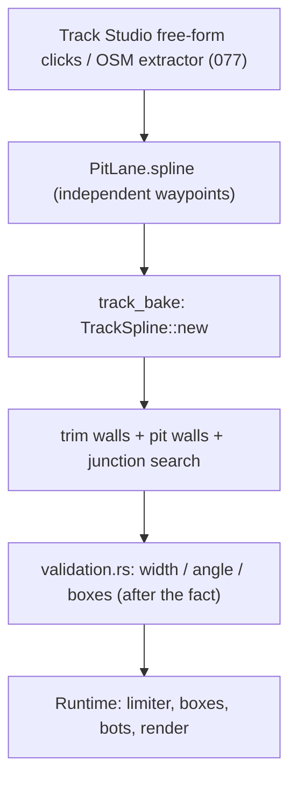
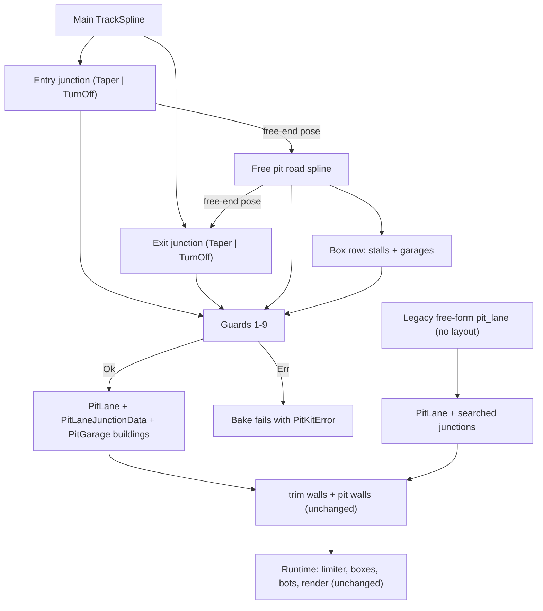

# Architecture Spec: Parametric Pit Lane Kit Blocks on Spline Circuits 🏗️

The main circuit stays a free-form spline. A pit lane is built from four parts:

1. **Entry junction**: a predefined component.
2. **Pit road**: a free-form spline.
3. **Box row**: a predefined component that places the stalls and the garages.
4. **Exit junction**: a predefined component.

The junctions are where pit lanes break today. They become fixed, tested components with a few parameters. The road between them stays free, because real pit lanes bend away from the track, cut inside corners, or leave before a turn.

Everything is compiled at bake time into the existing `PitLane` and `PitLaneJunctionData` structs. The runtime does not change.

This is the first use of the hybrid circuit-building approach: free splines for roads, predefined parametric components for structural features. The junction component is built for pit lanes here. Later specs can reuse it for branches (spec 006) and joker loops (spec 081).

---

## 🔍 Context & Problem Analysis

Today a pit lane is one independent Catmull-Rom spline (`PitLane.spline`, spec 062), authored in Track Studio or extracted from OSM (spec 077). It has no structural link to the main spline. This causes recurring cost:

1. **Junctions are searched, not known.** `Track::compute_pit_lane_junctions` (`crates/arcade-race-core/src/track/mod.rs`) projects every pit sample onto the main spline to find where the lanes separate. The gore apex, throat quads, chevrons and merge quads all depend on that search.
2. **Validation is after the fact.** `validation.rs` checks width, entry/exit angle (< 60°) and box count only after the geometry exists.
3. **Rescaling breaks pit lanes.** Spec 097 rescales GT circuits non-linearly. A free pit spline does not follow the main spline, so the junction ends drift off the track.
4. **Boxes are loose points.** The 6 `PitBox` stalls per circuit are placed independently of the road. No GT circuit has garage buildings, although `BuildingStyle::PitGarage` exists in `scenery.rs`.

A parallel-offset-only pit lane (the first draft of this spec) cannot describe real pit lanes that bend away from the track. Spec 077 needed several OSM ways for Catalunya, Portimão and Le Mans. So the road between the junctions must stay free.

---

## 🧩 Ideas Taken from the Modular Kit Study

A study compared tdrace pit lanes with a 3D-printed modular F1 circuit kit. That kit uses separate pieces for "pit entry from a straight", "pit entry turn", "pit road", "garage box" and "pit exit".

| Idea | Decision |
|------|----------|
| Separate entry variants: leave a straight with a taper, or turn off at an angle | **Taken.** `JunctionKind::Taper` and `JunctionKind::TurnOff`. |
| Garage box and stall as one unit along the pit road | **Taken.** The box row places a stall and a `PitGarage` building together. |
| Continuous pit wall between the main straight and the pit road | **Already present.** `generate_pit_lane_walls` builds it. It now starts and ends at the junction components. |
| Fixed piece sizes on a grid | **Rejected.** It distorts real circuits. Junction parameters stay continuous. |

---

## 🎯 Proposed Solution & Architectural Pillars

### Pillar I: Data Model

New module `crates/arcade-race-core/src/track/pit_kit.rs`:

```rust
/// Side of the main track (relative to driving direction) on which the pit lane runs.
#[derive(Debug, Clone, Copy, PartialEq, Eq, Serialize, Deserialize)]
pub enum PitSide { Left, Right }

/// Shape of a junction between the main track and the pit road.
#[derive(Debug, Clone, Copy, PartialEq, Serialize, Deserialize)]
pub enum JunctionKind {
    /// Smooth sideways taper; the pit road ends parallel to the main track.
    Taper,
    /// Pit road leaves (or rejoins) the main track at a fixed angle through a circular arc.
    TurnOff { angle_deg: f32 },
}

/// Predefined junction component anchored to the main spline.
#[derive(Debug, Clone, PartialEq, Serialize, Deserialize)]
pub struct PitJunction {
    /// Arc length on the main spline where the junction touches the track (m).
    /// Entry: where the split starts. Exit: where the merge ends.
    pub s: f32,
    pub kind: JunctionKind,
    /// Length of the junction along its own centreline (m).
    pub length: f32,
    /// Gap between main track edge and pit road edge at the junction's free end (m).
    pub divider_gap: f32,
}

/// Predefined box row component placed along the pit road.
#[derive(Debug, Clone, PartialEq, Serialize, Deserialize)]
pub struct PitBoxRow {
    /// Arc length along the compiled pit lane where the first box centre sits (m).
    pub start_s: f32,
    /// Number of stalls, >= 1.
    pub count: u32,
    /// Distance between stall centres (m).
    pub spacing: f32,
    /// Place one PitGarage building behind each stall.
    pub garages: bool,
}

/// Source of truth for a pit lane. Compiled at bake time into `PitLane`.
#[derive(Debug, Clone, PartialEq, Serialize, Deserialize)]
pub struct PitLaneLayout {
    pub side: PitSide,
    pub entry: PitJunction,
    pub exit: PitJunction,
    /// Interior control points of the free pit road, between the junction ends.
    /// May be empty: the road then joins the two junction ends directly.
    pub road_waypoints: Vec<Vec2>,
    pub road_width: f32,
    pub speed_limit: f32,
    pub box_row: PitBoxRow,
}
```

### Pillar II: Junction Components

Each junction is a pure function of the main spline and its parameters. It returns:
- its centreline samples,
- its **free-end pose** (point and heading) where the pit road starts or ends,
- its gate (`LineSegment` across the pit road at the free end),
- its part of `PitLaneJunctionData`: throat or merge quads, gore triangle, chevrons and attenuator nose position,
- the start or end point of the dividing pit wall.

Let `D = track_half_width(s) + divider_gap + road_width / 2` (centre-to-centre offset at the free end).

**`Taper`**
- Covers `[s, s + length]` on the main spline (entry) or `[s − length, s]` (exit).
- Lateral offset `d(t) = D · smoothstep(t)`, with `smoothstep(t) = 3t² − 2t³`.
- The free end is parallel to the main track.
- Maximum divergence angle is `atan(1.5 · D / length)`.

**`TurnOff { angle_deg }`**
- The pit road starts tangent to the track edge at `s`. A circular arc of length `length` then turns it away from the track by `angle_deg`.
- The free end heading is the main tangent rotated by `angle_deg` toward `side`.
- The arc radius is `length / angle_rad`.
- The exit is the mirror image: a circular arc that rejoins tangent to the track edge at `s`.

### Pillar III: Free Pit Road

The pit road is a centripetal Catmull-Rom spline (spec 071) through:
`[entry free end, entry free end + h · entry heading, road_waypoints…, exit free end − h · exit heading, exit free end]`, with `h = 5.0 m`.

The two guide points fix the road heading at both joints. The compiled pit lane spline is: entry junction samples, then road samples, then exit junction samples, as one `TrackSpline`.

### Pillar IV: Box Row Component

- Stall `i` sits at arc length `start_s + i · spacing` on the compiled pit lane, centred on the road and facing the lane direction. `stop_radius` is the spec 062 default (3.0 m).
- With `garages: true`, a `Building` with `BuildingStyle::PitGarage` is placed behind each stall, on the side away from the main track, outside the pit road and its outer wall.
- Each garage faces the road.
- When a layout exists, the layout is the only source of pit garages. The bake removes every `PitGarage` building and adds the generated ones. No GT circuit has a `PitGarage` building today.

### Pillar V: Guards (Fail Before Bake)

`PitLaneLayout::compile(&Track) -> Result<CompiledPitLane, PitKitError>` checks every rule. It returns an error and no lane when a rule fails.

| # | Rule | Error |
|---|------|-------|
| 1 | Parameter ranges: `road_width >= 4.0`, `divider_gap >= 0.0`, `length > 0`, `count >= 1`, `spacing > 0`, `10 <= angle_deg < 60` | `InvalidParameter { name }` |
| 2 | `Taper` divergence angle `atan(1.5 · D / length) < 60°` | `JunctionTooSteep { junction, angle_deg }` |
| 3 | Junction fold guard: on the pit side, `D + road_width / 2` is smaller than the local main-spline radius minus 3.0 m over the junction span | `OffsetExceedsCurvature { junction, s, radius }` |
| 4 | `TurnOff` arc radius `>= road_width / 2 + 3.0 m` | `ArcTooTight { junction, radius }` |
| 5 | Pit road minimum radius `>= road_width / 2 + 3.0 m` (same rule as spec 097) | `RoadTooTight { s, radius }` |
| 6 | Heading jump at each junction/road joint `<= 2°` | `JointKink { junction, angle_deg }` |
| 7 | Outside the junction spans, the pit road edge stays at least `divider_gap` from the main track edge, and the pit road does not cross itself | `RoadOverlapsTrack { s }` |
| 8 | Every stall lies on the road part (not in a junction) and on a stretch with radius `>= 50 m` | `BoxRowOffRoad { box_index }` |
| 9 | Junctions are in order: entry, then exit, along the driving direction. Wrap across S/F is allowed. | `JunctionOrder` |

### Pillar VI: Bake Integration

- `Track` gets a new optional field `pit_lane_layout: Option<PitLaneLayout>` (`#[serde(default)]`).
- When it is `Some`, `track_bake` compiles it and writes:
  - `pit_lane` (spline, width, speed limit, boxes, gates),
  - `pit_lane_junctions` (from the junction components; no search),
  - `PitGarage` buildings.
- Then `trim_walls_for_pit_lane` and `generate_pit_lane_walls` run. The dividing wall starts and ends at the points the junction components give.
- When it is `None`, the bake keeps the free-form `pit_lane` and searched junctions, as today (legacy path).
- A compile error fails the bake for that circuit with the error text. The bake never writes a partial lane.
- Compile is a pure function of the layout and the main spline. Two bakes in a row give the same JSON.

### Pillar VII: Track Studio

The Pit Lane tool (`[8]`) gets a **Layout** mode, which becomes the default. The free-form mode stays.
- Click 1 on the main track places the entry junction (`s` and `side` from the click).
- Click 2 places the exit junction.
- The editor fills `road_waypoints` with a parallel default road. The author drags road points to bend it. The guide points at the joints are locked.
- A panel edits:
  - junction kind, length, angle and gap,
  - road width,
  - box row start, count, spacing and garages.
- Each edit recompiles the preview.
- A guard error shows as a red message with the failing rule. The preview is not drawn.

### Pillar VIII: Migration of the 18 GT Pit Lanes

New script `scripts/fit_pit_layout.py`, for each circuit with a free-form `pit_lane`:
1. `side`: majority side of pit samples relative to the main spline.
2. Junctions: project the first and last pit waypoints for `s`. Try `Taper`, then `TurnOff` with the angle measured from the old lane. Pick the variant with the smaller deviation that passes the guards.
3. Road: keep the old pit waypoints that lie outside the junction spans as `road_waypoints`.
4. Box row: keep the 6 stalls. Fit `start_s` and `spacing` from the old box positions. Set `garages: true`.

A circuit converts only if the compiled centreline stays within **3.0 m** of the old centreline (max deviation, sampled every 1 m) and all guards pass. Otherwise it keeps its free-form lane, and the script lists the reason. The script writes `docs/circuits/pit_layout_migration.md`.

### Non-Goals

- No change to `PitLane`, `PitBox`, `PitLaneJunctionData`, `PitServiceState`, the speed limiter, the service sequence, bot pit tactics or HUD.
- No reuse of junctions for branches or joker loops in this spec.
- No new pit lanes on circuits that do not have one today.
- No fixed piece sizes or grid.

---

## 🗺️ Current vs. Proposed System Architecture

### 1. Current Architecture


### 2. Proposed Architecture


---

## 🗄️ Database & Storage Migration Plan

### 1. Circuit JSON (`tracks/` submodule)
- New optional key `pit_lane_layout`. JSON without it loads unchanged.
- Converted circuits keep `pit_lane` and `pit_lane_junctions` in the file as baked output. `pit_lane_layout` is the source of truth.
- Re-bake every converted circuit with `track_bake <files> --rebuild` two times. The second run must give no diff.
- Push the `tracks` submodule commit before `main` points at it.

### 2. Rollback
- Remove `pit_lane_layout` and the generated `PitGarage` buildings from a circuit JSON. The bake then uses the stored free-form `pit_lane`.

---

## 🔑 Security, Compliance, & IAM Roles

Not applicable. No network, accounts or secrets. Circuit JSON is first-party data embedded at build time (spec 042). `compile` still validates every parameter (Pillar V) because Track Studio writes user-authored JSON.

---

## 🛡️ Disaster Recovery, Monitoring, & Fallbacks

- **Fallback**: a circuit that fails the migration keeps its free-form lane. The legacy path stays supported.
- **Bake failure**: a compile error stops the bake for that circuit with a clear message.
- **Gameplay check**: the bot stall sweep (own-category cars, closed-loop circuits) runs on each converted GT circuit with pit stops enabled.

---

## 🧪 Verification & Acceptance Criteria

### Automated Tests
- `cargo test -p arcade-race-core --test pit_kit_tests`
- `cargo test -p tdrace-app --test pit_lane_integration_tests`
- `cargo test -p tdrace-app --test track_editor_tests`
- `cargo run --release -p tdrace-app --bin track_bake -- tracks/gt/*.json --rebuild` (run two times; `git -C tracks diff --stat` is empty after the second run)
- `python3 scripts/fit_pit_layout.py --dry-run`

### Manual Acceptance Criteria (Pseudo-Gherkin)

- **Scenario: A valid layout compiles to a PitLane that passes existing validation**
  - [ ] **Given** a closed main spline with a 400 m straight and a layout with Taper junctions, an empty `road_waypoints`, `road_width` 5.0 and a box row of 6
  - [ ] **When** `PitLaneLayout::compile` runs
  - [ ] **Then** it returns a pit lane with 6 stalls, entry and exit gates, and road width 5.0
  - [ ] **And** the track validation reports no pit lane errors

- **Scenario: Junction geometry comes from the component, not a search**
  - [ ] **Given** a compiled layout
  - [ ] **When** the baked `pit_lane_junctions` is read
  - [ ] **Then** it equals the data that the junction components returned
  - [ ] **And** the entry gore apex lies within 0.5 m of the point where the pit road edge leaves the track edge

- **Scenario: Taper divergence angle respects the analytic bound**
  - [ ] **Given** a Taper junction with offset `D` and length `L`
  - [ ] **When** the compiled junction is sampled every 0.5 m
  - [ ] **Then** the largest measured divergence angle is within 0.5° of `atan(1.5 · D / L)`

- **Scenario: A TurnOff junction leaves at its set angle**
  - [ ] **Given** an entry junction `TurnOff { angle_deg: 30 }`
  - [ ] **When** the layout compiles
  - [ ] **Then** the heading at the junction free end differs from the main tangent at `s` by 30° ± 0.5°, toward `side`

- **Scenario: The pit road can bend away from the track**
  - [ ] **Given** a layout whose `road_waypoints` bend the road 40 m away from the main track and back
  - [ ] **When** the layout compiles
  - [ ] **Then** the compiled lane passes through every road waypoint
  - [ ] **And** the heading jump at both junction joints is <= 2°

- **Scenario: Guards reject bad layouts before bake**
  - [ ] **Given** one layout per rule: a Taper too steep, an offset wider than a corner radius, a TurnOff arc too tight, a road bend too tight, a road point placed on the main track, a stall placed inside a junction
  - [ ] **When** `compile` runs on each
  - [ ] **Then** it returns `JunctionTooSteep`, `OffsetExceedsCurvature`, `ArcTooTight`, `RoadTooTight`, `RoadOverlapsTrack` and `BoxRowOffRoad` in that order, and no lane

- **Scenario: A pit lane can wrap across the start/finish line**
  - [ ] **Given** a layout whose exit `s` is smaller than its entry `s`
  - [ ] **When** `compile` runs
  - [ ] **Then** the compiled lane is one continuous spline from entry to exit through the S/F line

- **Scenario: Junctions follow a rescaled main spline**
  - [ ] **Given** a compiled layout on a circuit
  - [ ] **When** the main spline is scaled by 1.5, the junction `s` values are scaled by 1.5, and the road waypoints are scaled by 1.5 about the same origin
  - [ ] **Then** both junction free ends keep their `divider_gap` to the track edge within 0.1 m

- **Scenario: The box row places stalls and garages**
  - [ ] **Given** a box row with `count` 6, `spacing` 12 and `garages` true
  - [ ] **When** the layout compiles
  - [ ] **Then** there are 6 stalls 12 m apart along the lane
  - [ ] **And** there are 6 `PitGarage` buildings behind them, on the side away from the main track, that touch neither the road nor any wall

- **Scenario: Bake is deterministic and does not duplicate garages**
  - [ ] **Given** all converted circuits
  - [ ] **When** `track_bake --rebuild` runs two times
  - [ ] **Then** the second run makes no change in the `tracks` submodule
  - [ ] **And** each converted circuit has exactly one `PitGarage` building per stall

- **Scenario: Migration converts or reports each GT circuit**
  - [ ] **Given** the 18 GT circuits with a free-form `pit_lane`
  - [ ] **When** `scripts/fit_pit_layout.py` runs
  - [ ] **Then** each circuit is converted with max centreline deviation <= 3.0 m, or keeps its free-form lane with a stated reason
  - [ ] **And** `docs/circuits/pit_layout_migration.md` lists every circuit with its result, junction kinds and deviation

- **Scenario: Legacy free-form pit lanes still work**
  - [ ] **Given** a circuit JSON with `pit_lane` and no `pit_lane_layout`
  - [ ] **When** it loads and bakes
  - [ ] **Then** its `pit_lane` is unchanged and the pit lane integration tests pass on it

- **Scenario: Pit stops work on a converted circuit**
  - [ ] **Given** a converted GT circuit (for example `monza`) in a race with pit stops enabled
  - [ ] **When** a GT bot with tire wear above 0.70 reaches the pit entry
  - [ ] **Then** the bot enters the lane, the limiter engages, it stops in a stall, `pit_stops` increments, and it rejoins the race without stalling

- **Scenario: Track Studio Layout mode builds a pit lane**
  - [ ] **Given** Track Studio open on a circuit without a pit lane, with the Pit Lane tool in Layout mode
  - [ ] **When** the author clicks an entry point and then an exit point on the main track
  - [ ] **Then** a pit lane preview with default junctions, a parallel road and a box row appears on the clicked side
  - [ ] **And** dragging a road point bends the road while the joint guide points stay locked
  - [ ] **And** a parameter that fails a guard shows a red error with the rule name and hides the preview

---

## 🔗 Traceability & Codebase Mapping

### Created/Modified Files
- `[ ]` `crates/arcade-race-core/src/track/pit_kit.rs` -> New. Layout types, junction components, road, box row, guards, `compile`.
- `[ ]` `crates/arcade-race-core/src/track/mod.rs` -> Adds `pit_lane_layout: Option<PitLaneLayout>` to `Track`.
- `[ ]` `crates/arcade-race-core/src/track/bake.rs` -> Compiles the layout into `pit_lane`, `pit_lane_junctions` and garages before the wall steps.
- `[ ]` `crates/arcade-race-core/src/track/presets.rs` -> Sets `pit_lane_layout: None` in preset constructors.
- `[ ]` `crates/arcade-race-core/tests/pit_kit_tests.rs` -> New. Compile, components, guards, wrap, rescale, garages, determinism.
- `[ ]` `crates/tdrace-app/src/editor/tools.rs` -> Layout mode for the Pit Lane tool.
- `[ ]` `crates/tdrace-app/src/editor/ui.rs` -> Layout parameter panel and guard errors.
- `[ ]` `scripts/fit_pit_layout.py` -> New. Fits layouts to existing pit lanes and writes the report.
- `[ ]` `docs/circuits/pit_layout_migration.md` -> New. Per-circuit migration result.
- `[ ]` `tracks/gt/*.json` (submodule) -> `pit_lane_layout` and `PitGarage` buildings on converted circuits; re-baked.

### Verification Assertions
- `crates/arcade-race-core/src/track/pit_kit.rs` references `specs/101_parametric_pit_lane_kit_blocks_on_spline_circuits.md` in its module header comment.
- No file outside the list above changes `PitLane`, `PitBox`, `PitLaneJunctionData` or pit runtime behaviour.
