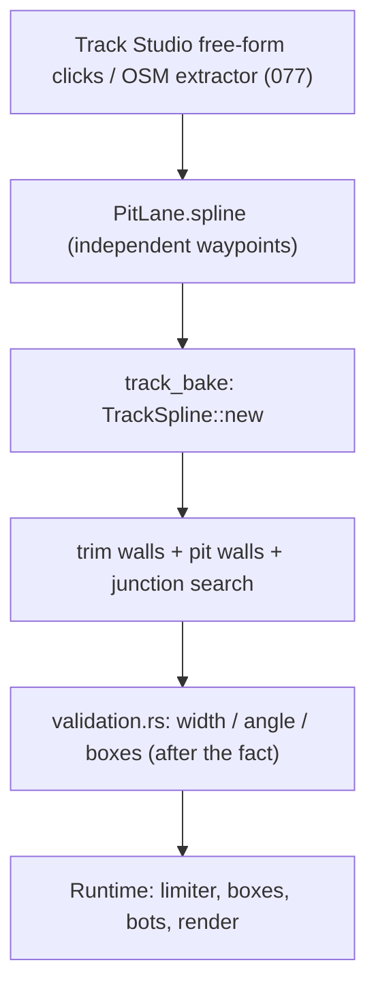
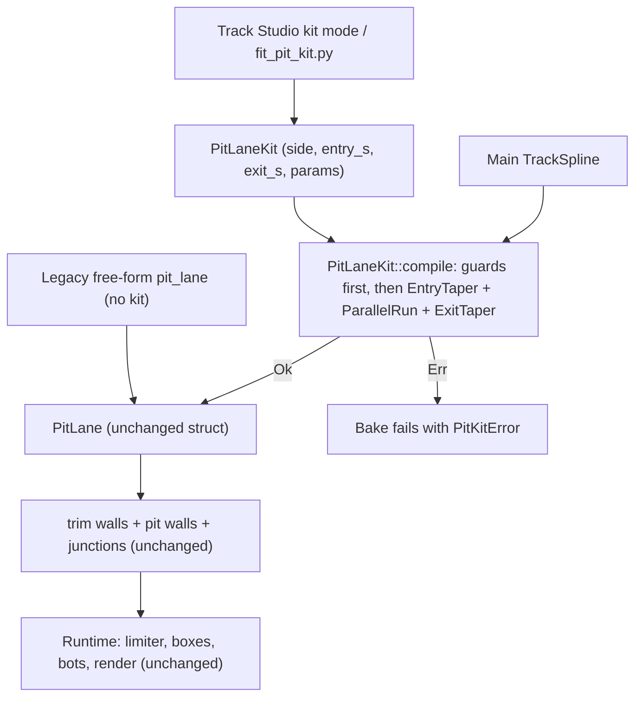

# Architecture Spec: Parametric Pit Lane Kit Blocks on Spline Circuits 🏗️

The main circuit stays a free-form spline. The pit lane becomes a **kit**: three predefined blocks with a few parameters, anchored to the main spline by arc length (`s`, metres along the racing line). The kit is compiled at bake time into the existing `PitLane` struct, so physics, bots, HUD, walls and render code do not change.

This is the first step of the hybrid circuit-building approach: free splines for the racing loop, predefined parametric blocks for structural features (pit lanes now; branches and joker loops in later specs).

---

## 🔍 Context & Problem Analysis

Today a pit lane is an independent Catmull-Rom spline (`PitLane.spline`, spec 062), authored by hand in Track Studio or extracted from OSM survey data (spec 077). It has no structural link to the main spline. This causes recurring cost:

1. **Junctions are searched, not known.** `Track::compute_pit_lane_junctions` (`crates/arcade-race-core/src/track/mod.rs`) projects every pit sample onto the main spline to find where the lanes separate. The gore apex, throat and merge quads depend on that search.
2. **Validation is after the fact.** `validation.rs` checks width, entry/exit angle (< 60°) and box count only once the geometry exists. A bad lane is found late and fixed by hand.
3. **Rescaling breaks pit lanes.** Spec 097 (in progress) rescales GT circuits non-linearly. A free pit spline does not follow the main spline, so every rescale needs a pit re-extraction or a manual fix.
4. **Offset curves can self-intersect.** A lane offset to the inside of a corner tighter than the offset distance folds over (the swallowtail problem of spec 080). Nothing prevents an author from making one.

All 18 pit lanes in the catalog are on GT circuits (`tracks/gt/*.json`). Most real pit lanes run parallel to the start/finish straight, which a parametric offset describes well.

---

## 🎯 Proposed Solution & Architectural Pillars

### Pillar I: The Kit (Data Model)

New module `crates/arcade-race-core/src/track/pit_kit.rs`:

```rust
/// Side of the main track (relative to driving direction) on which the pit lane runs.
#[derive(Debug, Clone, Copy, PartialEq, Eq, Serialize, Deserialize)]
pub enum PitSide { Left, Right }

/// Parametric pit lane anchored to the main circuit spline by arc length.
/// Compiled at bake time into a `PitLane`.
#[derive(Debug, Clone, PartialEq, Serialize, Deserialize)]
pub struct PitLaneKit {
    pub side: PitSide,
    /// Arc length on the main spline where the entry taper starts (m).
    pub entry_s: f32,
    /// Arc length on the main spline where the exit taper ends (m). May be < entry_s (wraps across S/F).
    pub exit_s: f32,
    /// Length of the entry taper block along the main spline (m).
    pub entry_length: f32,
    /// Length of the exit taper block along the main spline (m).
    pub exit_length: f32,
    /// Gap between the main track edge and the pit road inner edge in the parallel block (m).
    pub divider_gap: f32,
    /// Pit road width (m), >= 4.0.
    pub road_width: f32,
    /// Speed limit (m/s). Defaults to `PitLane::DEFAULT_ROAD_SPEED_LIMIT`.
    pub speed_limit: f32,
    /// Number of pit boxes in the parallel block, >= 1.
    pub box_count: u32,
    /// Distance between box centres along the lane (m).
    pub box_spacing: f32,
}
```

### Pillar II: The Three Blocks

The lane centreline is the main spline offset by a lateral distance `d(s)` toward `side`. Each block sets `d(s)`:

| Block | Span on main spline | Lateral offset `d(s)` |
|-------|---------------------|-----------------------|
| `EntryTaper` | `[entry_s, entry_s + entry_length]` | `D · smoothstep(t)`, `t` from 0 to 1 |
| `ParallelRun` | between the tapers | `D` (constant); holds the box row |
| `ExitTaper` | `[exit_s − exit_length, exit_s]` | `D · smoothstep(1 − t)` |

- `D = track_half_width(s) + divider_gap + road_width / 2`.
- `smoothstep(t) = 3t² − 2t³`. The lane leaves and rejoins the track tangentially, with no kink at the block joints.
- Box row: `box_count` boxes centred in the `ParallelRun`, spaced `box_spacing`, facing the lane direction. `stop_radius` is the spec 062 default (3.0 m).
- Entry and exit gates: line segments across the lane at the taper/parallel joints.

### Pillar III: Analytic Guards (Fail Before Bake)

`PitLaneKit::compile(&TrackSpline) -> Result<PitLane, PitKitError>` checks these rules before it makes geometry. It returns an error and no lane when a rule fails.

1. **Divergence angle bound.** The maximum slope of `D · smoothstep` is `1.5 · D / L`. The maximum divergence angle is `atan(1.5 · D / L)`. This angle must be < 60° (spec 062 rule) for both tapers. Error: `TaperTooSteep { block, angle_deg }`.
2. **Curvature guard.** On the pit side, the offset `D + road_width / 2` must be smaller than the local radius of curvature minus a 3.0 m margin, at every main-spline sample in `[entry_s, exit_s]`. This prevents self-intersection. Error: `OffsetExceedsCurvature { s, radius, offset }`.
3. **Length fit.** `entry_length + exit_length + (box_count − 1) · box_spacing` must fit between `entry_s` and `exit_s`. Error: `BlocksDoNotFit`.
4. **Parameter ranges.** `road_width >= 4.0`, `divider_gap >= 0.0`, `box_count >= 1`, lengths > 0. Error: `InvalidParameter { name }`.

### Pillar IV: Bake Integration and Precedence

- `Track` gets a new optional field `pit_lane_kit: Option<PitLaneKit>`.
- In `track_bake`, when `pit_lane_kit` is `Some`, the bake compiles it and writes the result into `pit_lane`. Then the existing steps run unchanged: `trim_walls_for_pit_lane`, `generate_pit_lane_walls`, `recompute_pit_lane_junctions`.
- When `pit_lane_kit` is `None`, the bake keeps the free-form `pit_lane` as it does today (legacy path).
- A compile error fails the bake for that circuit with the error text. It does not silently fall back.
- Compile is a pure function of the kit and the main spline. Two bakes in a row give the same JSON.

### Pillar V: Track Studio

The Pit Lane tool (`[8]`) gets a **Kit** mode, which becomes the default. The free-form mode stays.
- Click 1 on the main track sets `entry_s` and `side` (side of the click relative to the centreline).
- Click 2 sets `exit_s`.
- A parameter panel edits `entry_length`, `exit_length`, `divider_gap`, `road_width`, `box_count`, `box_spacing`. Each edit recompiles the preview.
- A compile error shows as a red message in the panel. The preview is not drawn.

### Pillar VI: Migration of the 18 GT Pit Lanes

New script `scripts/fit_pit_kit.py` fits a kit to each circuit's existing `pit_lane`:
1. `side`: majority side of pit samples relative to the main spline.
2. `entry_s`, `exit_s`: projections of the first and last pit waypoints.
3. `divider_gap`, `road_width`, `box_count`, `box_spacing`: medians from the existing lane and boxes.
4. Taper lengths: search for the shortest lengths that pass the guards.

A circuit converts only if the compiled kit centreline stays within **3.0 m** of the old centreline (max deviation, sampled every 1 m). Otherwise the circuit keeps its free-form `pit_lane`, and the script lists it with the deviation. The script writes a report: `docs/circuits/pit_kit_migration.md`.

### Non-Goals

- No change to `PitLane`, `PitBox`, `PitServiceState`, the speed limiter, the service sequence, bot pit tactics or HUD.
- No change to how `compute_pit_lane_junctions` works. It consumes the compiled lane.
- Branches, joker loops and other structural blocks are later specs.
- No new pit lanes on circuits that do not have one today.

---

## 🗺️ Current vs. Proposed System Architecture

### 1. Current Architecture


### 2. Proposed Architecture


---

## 🗄️ Database & Storage Migration Plan

### 1. Circuit JSON (`tracks/` submodule)
- New optional key `pit_lane_kit`. Older JSON without it loads unchanged (`#[serde(default)]`).
- Converted circuits keep `pit_lane` in the file as the baked output. `pit_lane_kit` is the source of truth.
- Re-bake every converted circuit with `track_bake --rebuild` two times and confirm the second run gives no diff.
- Commit and push the `tracks` submodule commit before `main` points at it.

### 2. Rollback
- Remove `pit_lane_kit` from a circuit JSON. The bake then uses the stored free-form `pit_lane`. No other data changes.

---

## 🔑 Security, Compliance, & IAM Roles

Not applicable. No network, accounts or secrets. Circuit JSON is first-party data embedded at build time (spec 042). `compile` still validates every parameter (Pillar III) because the Track Studio writes user-authored JSON.

---

## 🛡️ Disaster Recovery, Monitoring, & Fallbacks

- **Fallback**: a circuit that fails the 3.0 m fit keeps its free-form lane. The legacy path stays supported.
- **Bake failure**: a kit compile error stops the bake for that circuit with a clear message. It never writes a partial lane.
- **Gameplay check**: the bot stall sweep (own-category cars, closed-loop circuits) runs on each converted GT circuit with pit stops enabled.

---

## 🧪 Verification & Acceptance Criteria

### Automated Tests
- `cargo test -p arcade-race-core pit_kit`
- `cargo test -p tdrace-app --test pit_lane_integration_tests`
- `cargo test -p tdrace-app --test track_editor_tests`
- `cargo run --release -p tdrace-app --bin track_bake -- tracks/gt/*.json --rebuild` (run two times; `git -C tracks diff --stat` is empty after the second run)
- `python3 scripts/fit_pit_kit.py --dry-run`

### Manual Acceptance Criteria (Pseudo-Gherkin)

- **Scenario: A valid kit compiles to a PitLane that passes existing validation**
  - [ ] **Given** a closed main spline with a straight of 400 m and a kit with `road_width` 5.0, `divider_gap` 2.0, `box_count` 6 on that straight
  - [ ] **When** `PitLaneKit::compile` runs
  - [ ] **Then** it returns a `PitLane` with 6 pit boxes, entry and exit gates, and road width 5.0
  - [ ] **And** the track validation reports no pit lane errors

- **Scenario: Taper divergence angle respects the analytic bound**
  - [ ] **Given** a kit with offset `D` and entry taper length `L`
  - [ ] **When** the compiled lane is sampled every 0.5 m along the entry taper
  - [ ] **Then** the largest measured divergence angle is within 0.5° of `atan(1.5 · D / L)`

- **Scenario: A taper that is too short is rejected**
  - [ ] **Given** a kit whose entry taper gives `atan(1.5 · D / L)` >= 60°
  - [ ] **When** `compile` runs
  - [ ] **Then** it returns `TaperTooSteep` and no lane

- **Scenario: The curvature guard prevents a folded pit lane**
  - [ ] **Given** a kit on the inside of a corner whose radius is smaller than the offset plus 3.0 m
  - [ ] **When** `compile` runs
  - [ ] **Then** it returns `OffsetExceedsCurvature` with the arc length of the failing sample

- **Scenario: A pit lane can wrap across the start/finish line**
  - [ ] **Given** a kit with `exit_s` < `entry_s`
  - [ ] **When** `compile` runs
  - [ ] **Then** the compiled lane is one continuous spline from entry to exit through the S/F line

- **Scenario: The pit lane follows a rescaled main spline**
  - [ ] **Given** a compiled kit on a circuit
  - [ ] **When** the main spline is scaled by 1.5 and the kit is compiled again with `entry_s` and `exit_s` scaled by 1.5
  - [ ] **Then** every pit box keeps the same `divider_gap` to the track edge within 0.1 m

- **Scenario: Bake is deterministic**
  - [ ] **Given** all converted circuits
  - [ ] **When** `track_bake --rebuild` runs two times
  - [ ] **Then** the second run makes no change in the `tracks` submodule

- **Scenario: Migration converts or reports each GT circuit**
  - [ ] **Given** the 18 GT circuits with a free-form `pit_lane`
  - [ ] **When** `scripts/fit_pit_kit.py` runs
  - [ ] **Then** each circuit is converted with max centreline deviation <= 3.0 m, or keeps its free-form lane
  - [ ] **And** `docs/circuits/pit_kit_migration.md` lists every circuit with its result and deviation

- **Scenario: Legacy free-form pit lanes still work**
  - [ ] **Given** a circuit JSON with `pit_lane` and no `pit_lane_kit`
  - [ ] **When** it loads and bakes
  - [ ] **Then** its `pit_lane` is unchanged and the pit lane integration tests pass on it

- **Scenario: Pit stops work on a converted circuit**
  - [ ] **Given** a converted GT circuit (for example `monza`) in a race with pit stops enabled
  - [ ] **When** a GT bot with tire wear above 0.70 reaches the pit entry
  - [ ] **Then** the bot enters the lane, the limiter engages, it stops in a box, `pit_stops` increments, and it rejoins the race without stalling

- **Scenario: Track Studio kit mode creates a pit lane with two clicks**
  - [ ] **Given** Track Studio open on a circuit without a pit lane, Pit Lane tool in Kit mode
  - [ ] **When** the author clicks the entry point and then the exit point on the main track
  - [ ] **Then** a pit lane preview with default parameters appears on the clicked side
  - [ ] **And** changing `box_count` in the panel updates the preview
  - [ ] **And** a parameter that fails a guard shows a red error and hides the preview

---

## 🔗 Traceability & Codebase Mapping

### Created/Modified Files
- `[ ]` `crates/arcade-race-core/src/track/pit_kit.rs` -> New. `PitLaneKit`, `PitSide`, `PitKitError`, blocks, guards, `compile`.
- `[ ]` `crates/arcade-race-core/src/track/mod.rs` -> Adds `pit_lane_kit: Option<PitLaneKit>` to `Track`.
- `[ ]` `crates/arcade-race-core/src/track/bake.rs` -> Compiles the kit into `pit_lane` before wall and junction steps.
- `[ ]` `crates/arcade-race-core/src/track/presets.rs` -> Sets `pit_lane_kit: None` in preset constructors.
- `[ ]` `crates/tdrace-app/src/editor/tools.rs` -> Kit mode for the Pit Lane tool.
- `[ ]` `crates/tdrace-app/src/editor/ui.rs` -> Kit parameter panel and error message.
- `[ ]` `scripts/fit_pit_kit.py` -> New. Fits kits to existing pit lanes and writes the report.
- `[ ]` `docs/circuits/pit_kit_migration.md` -> New. Per-circuit migration result.
- `[ ]` `crates/arcade-race-core/tests/pit_kit_tests.rs` -> New. Compile, guards, wrap, rescale, determinism.
- `[ ]` `tracks/gt/*.json` (submodule) -> `pit_lane_kit` added on converted circuits; re-baked.

### Verification Assertions
- `crates/arcade-race-core/src/track/pit_kit.rs` references `specs/101_parametric_pit_lane_kit_blocks_on_spline_circuits.md` in its module header comment.
- No file outside the list above changes `PitLane`, `PitBox` or pit runtime behaviour.
