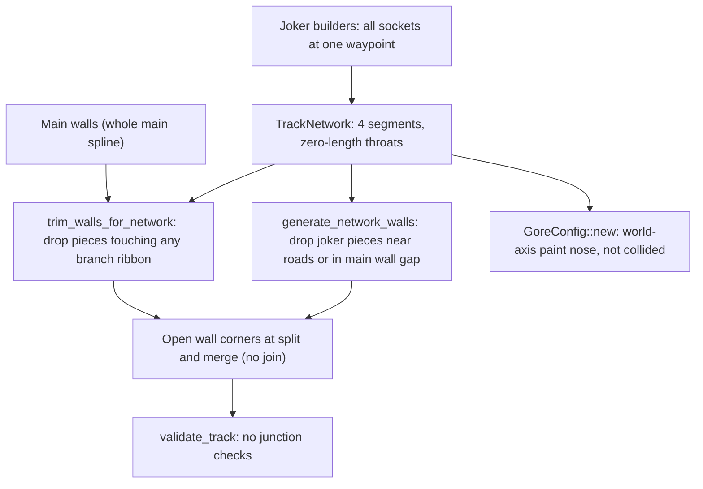
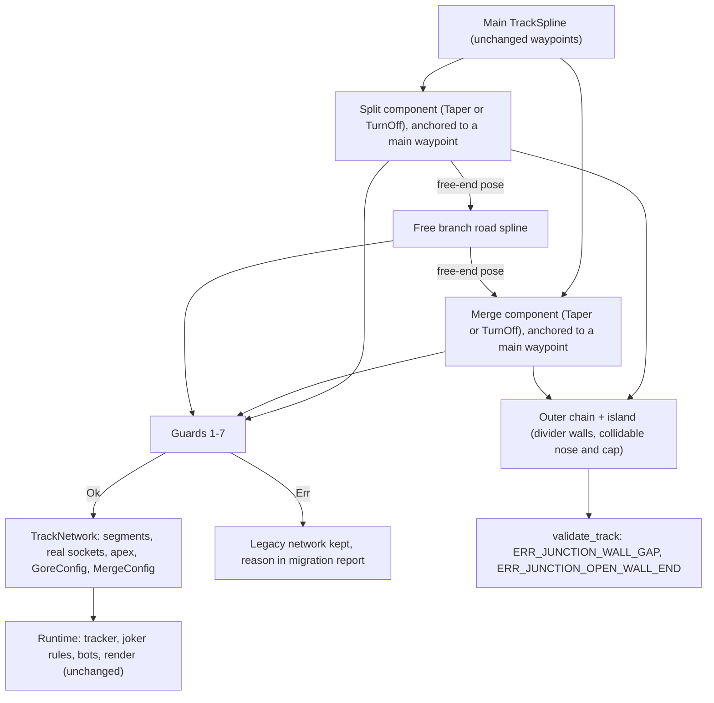

# Architecture Spec: Predefined Junction Components for Road Splits and Joker Loops 🏗️

The main route stays a free-form spline. A branch (today: the rallycross joker) is built from three parts:

1. **Split junction**: a predefined component from spec 101.
2. **Branch road**: a free-form spline.
3. **Merge junction**: a predefined component from spec 101.

Each junction gives its own throat, gore, nose barrier and walls. The walls around a junction are therefore known, not searched. Today they are searched and clipped, and that leaves holes.

Spec 101 builds the junction component for pit lanes. This spec moves it into a shared module and uses it for branches. Pit lanes do not change here.

Everything is compiled into the existing `TrackNetwork` (spec 006). The race runtime, joker rules (spec 082) and bot routing do not change.

---

## 🔍 Context & Problem Analysis

20 World RX circuits (`tracks/rally/*.json`) and 3 Classic RX circuits (`tracks/classic/rx_canyon_flyer.json`, `rx_hilltop_leap.json`, `rx_quarry_sprint.json`) have a joker branch. All 23 use the same network: segment 0 (start to split), 1 (main between the junctions), 2 (joker), 3 (merge to finish), with layouts `main = [0, 1, 3]` and `joker = [0, 2, 3]`.

The builders are `crates/tdrace-app/src/bin/build_world_rx_joker.rs` and `build_classic_rx_joker.rs`. They cause four problems:

1. **Zero-length throats.** All sockets of each split and merge sit at one point (bead `tdrace-070o`). The branch leaves the main road inside the joker spline, not in a throat. Throat quads and the gore triangle in `TrackNetwork::sample_surface` (`network.rs`) have zero area on the 20 rally circuits. On the 3 classic circuits the gore is a 15 m asphalt triangle with chevrons at the junction point.
2. **Walls are clipped, not joined.**
   - `Track::trim_walls_for_network` (`track/mod.rs`) drops main wall pieces that touch any branch ribbon.
   - `Track::generate_network_walls` drops joker wall pieces closer than 0.3 m to any road, or inside the main wall gap (spec 088).
   - No code joins the cut ends. So each split and merge throat keeps an open outer corner of a few metres up to 42 m (beads `tdrace-74s5` and `tdrace-joker-junction-wall-holes-5vqt`, for example `kouvola_rx`, `mettet_rx`, `croft_rx`, `holjes_rx`).
3. **The nose barrier is paint.**
   - `GoreConfig::new` places a 2.4 m segment at `apex + (±1.2, −0.6)` in world axes. It does not follow the road.
   - `race-kit/src/world.rs` does not collide with it. A car can drive through the gore apex.
4. **Nothing checks junction walls.**
   - `validate_track` (`track/validation.rs`) has no network, junction or branch check.
   - The rally wall tests skip every ray that ends within 4 m of another road (`rally_tracks_tests.rs`). That area is exactly the throat.

Pit lanes (spec 101) had the same root cause: junction geometry was searched after the fact. Spec 101 fixes it with predefined junction components. A joker branch has the same shape as a pit lane: it leaves the main road on one side and rejoins it later. So the same component fits.

---

## 🎯 Proposed Solution & Architectural Pillars

### Pillar I: Shared Junction Component

New module `crates/arcade-race-core/src/track/junction_kit.rs`. It receives the junction component of spec 101 **without a change to its geometry, parameters or guards**:

| Spec 101 name (`pit_kit.rs`) | Name in `junction_kit.rs` | Reason |
|------------------------------|---------------------------|--------|
| `PitSide` | `Side` | Not only for pit lanes. |
| `JunctionKind` | `JunctionShape` | `network.rs` already has `JunctionKind` (Split, Merge, Terminal). The branch code uses both. |
| `PitJunction` | `JunctionComponent` | Not only for pit lanes. |
| Guard rules 1–4 and 6 (parameters, too steep, fold, arc too tight, joint kink) | `JunctionError` | They are junction rules, not pit rules. |

- `pit_kit.rs` uses the new names. `PitKitError` gets the variant `Junction(JunctionError)` for these rules.
- The JSON does not change. Serde writes field and variant names, not type names.
- Spec 101's pit tests pass without a change except imports.

`junction_kit.rs` also gets these new outputs. Spec 101's pit compile can use them, but this spec does not change pit lanes.
- **Apex**: the point where the branch road edge leaves the main road edge (edge gap `G = 0`).
- **Nose point**: the first point after the apex where `G >= 2.2 m`. `2.2 m` is the 1.6 m nose plus 0.3 m clearance on each side.
- **Outer envelope**: on `side`, the outer edge of the union of the main and branch ribbons, sampled every 1 m over the junction span.

### Pillar II: Branch Layout Data Model

New module `crates/arcade-race-core/src/track/branch_kit.rs`:

```rust
/// Source of truth for a branch that leaves the main route and rejoins it.
/// Compiled into `Track::network`.
#[derive(Debug, Clone, PartialEq, Serialize, Deserialize)]
pub struct BranchLayout {
    /// Id of the TrackLayout that takes the branch (for example "joker").
    pub layout_id: String,
    pub name: String,
    /// Side of the main route (relative to driving direction) on which the branch leaves.
    pub side: Side,
    /// `s` must be the arc length of a main waypoint (guard 2).
    pub split: JunctionComponent,
    /// `s` must be the arc length of a main waypoint (guard 2).
    pub merge: JunctionComponent,
    /// Interior waypoints of the free branch road, between the junction free ends.
    /// Full waypoints, so a branch keeps its own width, surface and elevation per point.
    pub road_waypoints: Vec<TrackWaypoint>,
    pub road_width: f32,
    pub nose_barrier: BarrierType,
}
```

- `Track` gets `#[serde(default, skip_serializing_if = "Option::is_none")] branch_layout: Option<BranchLayout>`.
- One branch per circuit. All 23 circuits have one.
- The anchors are main waypoints because of spec 088: an extra waypoint at the split moved the main line on `dreux_rx`. The main route keeps every waypoint and its exact shape.

### Pillar III: Compile

`BranchLayout::compile(&Track) -> Result<CompiledBranch, BranchKitError>` is a pure function of the layout and the main spline. It gives:

1. **Segments**:
   - 0: start to the split anchor.
   - 1: main between the anchors.
   - 2: the branch. It is the split component, then the free road, then the merge component, as one `RoadSegment`.
   - 3: merge anchor to finish.
   - The free road is built as in spec 101 Pillar III: centripetal Catmull-Rom through the free ends, with 5 m guide points that fix the heading at both joints.
2. **Junctions**:
   - Split: the ingress socket and egress socket 0 are the main road at the anchor. Egress socket 1 is the branch start that the component gives.
   - Merge: the mirror image.
   - `GoreConfig`:
     - `apex_point`: the component apex.
     - `gore_length`: the arc length from the apex to the nose point.
     - `divergence_angle`: the heading difference at the nose point.
     - `nose_barrier`: the nose of Pillar IV.
     - `has_chevrons`: `false`.
   - `MergeConfig` is filled the same way at the merge.
3. **Layouts**: `main = [0, 1, 3]` and `layout_id = [0, 2, 3]`, as today.
4. **Joker checkpoint**: at the arc-length midpoint of segment 2, as the World RX builder places it today.

A compiled junction has a throat of length `length` along the main road. In the throat the two ribbons overlap. No throat quad is needed:
- **Surface**: a point inside the main ribbon takes the main surface. A point in the branch ribbon and outside the main ribbon takes the branch surface. A point in the gore (between the apex and the nose) takes the circuit's run-off surface. No asphalt is forced.
- **Render**: the branch ribbon is drawn before the main ribbon, so the main road is on top in the throat. `render_network_junctions_pass` skips compiled junctions. Their throat, gore and nose are drawn as normal road ribbons and walls. This follows the rules of spec 085 for these junctions. It does not implement spec 085.
- **Bots**: bots read `gore.apex_point` and the gates, as today (spec 085). The apex is now the real apex.

### Pillar IV: Walls Built by the Component

The component gives every wall in the junction region. Let `g` be `local_barrier_offset` at the junction (the median main wall gap within ±20 m).

```
main wall (side) ─► outer envelope wall (split) ─► branch outer wall ─► outer envelope wall (merge) ─► main wall (side)

                    split nose ┌─ divider wall, main side ───┐ merge cap
                               └─ divider wall, branch side ─┘
```

1. **Outer chain.** On `side`, a wall at `g` outside the outer envelope runs from the split anchor to the split free end.
   - It starts at the point where the main wall on `side` crosses the main normal at the anchor. It blends to the envelope offset over the first 5 m.
   - It joins the branch outer wall at the free end. The merge is the mirror image.
   - The result is one unbroken wall from the main wall before the split, round the branch, to the main wall after the merge.
2. **Island.** The area between the main road and the branch, from the split nose to the merge nose, is a closed wall loop:
   - **Divider walls**: one along the main edge and one along the branch inner edge. The offset from each road edge is `o(t) = min(g, (G(t) − 1.6) / 2)`, where `G(t)` is the edge gap. So both walls are 0.3 m off their road at the nose, and `g` off it where the roads are far apart.
   - **Split nose**: a 1.6 m `nose_barrier` segment at the split nose point. It is perpendicular to the gore bisector and joins the starts of the two divider walls.
   - **Merge cap**: a 1.6 m segment of the same type that joins the ends of the two divider walls at the merge nose point.
   - The nose and the cap are collidable. They go into `geometry.network_walls`, which `race-kit/src/world.rs` already collides.
3. **Main wall on the far side**: no change.
4. **Branch outer wall on the free road**: `generate_network_walls` with the rules of spec 088, on the outer side of the free road only. Its ends join the outer chain at the free ends.
5. **No search-based trim for compiled branches.** Main walls on `side` are replaced by arc length, from the split anchor to the merge anchor. `trim_walls_for_network` stays for legacy networks only.
6. Walls are built on load from `branch_layout` and never saved, as network walls are today.

### Pillar V: Guards (Fail Before Bake)

`compile` checks every rule. It returns an error and no network when a rule fails.

| # | Rule | Error |
|---|------|-------|
| 1 | The junction rules of spec 101 (parameter ranges, Taper too steep, offset wider than the corner radius, TurnOff arc too tight, joint kink > 2°) | `Junction(JunctionError)` |
| 2 | Each junction `s` is the arc length of a main waypoint, ±0.01 m | `AnchorOffWaypoint { junction }` |
| 3 | `divider_gap >= 2.2 m`, so the nose lies inside the junction span | `NoseOutsideJunction { junction }` |
| 4 | Between the split nose and the merge nose, the edge gap between the main road and the branch is `>= 2.2 m` | `DividerTooNarrow { s }` |
| 5 | Free road minimum radius `>= road_width / 2 + 3.0 m` (as spec 097) | `RoadTooTight { s, radius }` |
| 6 | The split is before the merge along the driving direction. Wrap across S/F is allowed. | `JunctionOrder` |
| 7 | `layout_id` is not `main` and not empty | `InvalidParameter { name }` |

### Pillar VI: Junction Wall Validation

`validate_track` gets a junction section. It runs on every network, compiled or legacy.

| Code | Severity | Check |
|------|----------|-------|
| `ERR_JUNCTION_WALL_GAP` | Error on compiled junctions. Warning (`WARN_JUNCTION_WALL_GAP`) on legacy junctions. | From the road edge on the outer side, every 1 m from 10 m before the split anchor to 10 m after the split free end, a ray along the outward normal hits a wall within `g + 1.0 m`. The same check runs at the merge. Inside the island, a ray from each road edge toward the other road hits a wall before it reaches the other road. |
| `ERR_JUNCTION_OPEN_WALL_END` | Error on compiled junctions. Warning (`WARN_JUNCTION_OPEN_WALL_END`) on legacy junctions. | In the junction region, every wall end touches another wall end within 0.05 m. |

- The existing wall checks (`ERR_WALL_CROSSES_TRACK`, `ERR_WALL_INTRUDES_TRACK`, `ERR_WALL_SELF_INTERSECTION`) also run on the junction walls, against every network segment.
- Legacy junctions only warn, so the circuits that the migration cannot convert still pass validation. The warnings list their holes.

### Pillar VII: Builder Migration of the 23 Circuits

`build_world_rx_joker.rs` and `build_classic_rx_joker.rs` write a `branch_layout` and then compile it. They no longer write sockets by hand. For each circuit:

1. **Anchors and side**: the split and merge waypoints and the side that the builders use today (`JokerCut`, spec 088).
2. **Shape**: try `Taper`, then `TurnOff` with the angle measured from the old joker. Try `length` from 10 m to 40 m in 5 m steps. Pick the fit with the smallest deviation that passes the guards.
3. **Free road**: the old joker points outside the junction spans, with their surfaces, become `road_waypoints`.
4. **Accept** the fit if all of these are true:
   - The compiled branch centreline stays within **2.0 m** of the old joker centreline (max deviation, sampled every 1 m).
   - The joker still costs the lap time that spec 088 requires.
   - Validation reports no error.
5. **Otherwise** the circuit keeps its legacy network, and the builder prints the reason.

The builders write `docs/circuits/branch_junction_migration.md`. It has one row per circuit: result, shape, length, deviation and the reason for a fallback.

### Non-Goals

- No change to pit lanes. Spec 101 owns them. This spec only moves the shared types.
- No new branches. No circuit with more than one branch. No branches on non-RX circuits.
- No change to main route waypoints, the far-side main walls, checkpoints (except the joker checkpoint position), joker rules (spec 082) or bot route choice.
- No Track Studio authoring of branch layouts. Track Studio loads and saves `branch_layout` without a change. The legacy Road Split tool and `GoreConfig::new` do not change.
- No elevated or bridged junctions.
- Spec 085 (pacenote HUD, chevron and bullseye removal for legacy junctions and pit lanes) stays a separate spec.

---

## 🗺️ Current vs. Proposed System Architecture

### 1. Current Architecture


### 2. Proposed Architecture


---

## 🗄️ Database & Storage Migration Plan

### 1. Circuit JSON (`tracks/` submodule)
- New optional key `branch_layout`. JSON without it loads unchanged.
- Converted circuits keep `network` in the file as baked output. `branch_layout` is the source of truth.
- Run each builder, then `track_bake --rebuild` two times on the converted circuits. The second run must give no diff.
- Push the `tracks` submodule commit before `main` points at it.

### 2. Rollback
- Remove `branch_layout` from a circuit JSON and restore its `network` from the previous `tracks` commit. The legacy path stays supported.

---

## 🔑 Security, Compliance, & IAM Roles

Not applicable. No network access, accounts or secrets. Circuit JSON is first-party data embedded at build time (spec 042). `compile` still checks every parameter (Pillar V), because Track Studio writes user-edited JSON.

---

## 🛡️ Disaster Recovery, Monitoring, & Fallbacks

- **Fallback**: a circuit that fails the fit keeps its legacy network. Its junction wall problems show as warnings in validation.
- **Bake failure**: a compile error stops the bake for that circuit with the error text. The bake never writes a partial network.
- **Gameplay check**: the bot stall sweep (own-category cars, closed-loop circuits) runs on every converted circuit. Bead `tdrace-xg1x` (bots fail the joker on `kouvola_rx`, `lavare_rx` and `killarney_rx`) is checked again after the migration.

---

## 🧪 Verification & Acceptance Criteria

### Automated Tests
- `cargo test -p arcade-race-core --test junction_kit_tests`
- `cargo test -p arcade-race-core --test branch_kit_tests`
- `cargo test -p arcade-race-core --test pit_kit_tests` (spec 101, after the move)
- `cargo test -p arcade-race-core --test multi_route_progress_tests`
- `cargo test -p tdrace-app --test rally_tracks_tests`
- `cargo test -p tdrace-core --test classic_circuits_tests`
- `cargo test -p tdrace-app --test classic_circuits_bot_tests`
- `cargo test -p tdrace-app --test ai_tests`
- `cargo test -p tdrace-app --test track_editor_tests`
- `cargo run --release -p tdrace-app --bin build_world_rx_joker` and `cargo run --release -p tdrace-app --bin build_classic_rx_joker`
- `cargo run --release -p tdrace-app --bin track_bake -- tracks/rally/*.json tracks/classic/rx_*.json --rebuild` (run two times; `git -C tracks diff --stat` is empty after the second run)

### Manual Acceptance Criteria (Pseudo-Gherkin)

- **Scenario: A branch layout compiles to a valid network with a real throat**
  - [ ] **Given** a closed main spline and a branch layout with Taper junctions anchored on main waypoints, `divider_gap` 4.0 and a free road that bends 40 m away from the main route
  - [ ] **When** `BranchLayout::compile` runs
  - [ ] **Then** it returns 4 segments, layouts `main = [0, 1, 3]` and `joker = [0, 2, 3]`, and one Split and one Merge junction
  - [ ] **And** the split apex lies within 0.5 m of the point where the branch edge leaves the main edge
  - [ ] **And** `TrackNetwork::validate` and `validate_track` report no error

- **Scenario: The main route does not change**
  - [ ] **Given** a converted circuit
  - [ ] **When** its main waypoints and main spline samples are compared with the previous `tracks` commit
  - [ ] **Then** they are identical

- **Scenario: The outer wall is unbroken from the main road round the branch**
  - [ ] **Given** a compiled branch
  - [ ] **When** rays are cast outward every 1 m from the outer road edge, from 10 m before the split anchor to 10 m after the split free end, and the same at the merge
  - [ ] **Then** every ray hits a wall within `g + 1.0 m`
  - [ ] **And** no wall end in the junction region is more than 0.05 m from another wall end

- **Scenario: The island is a closed loop with a collidable nose**
  - [ ] **Given** a compiled branch
  - [ ] **When** the island walls are read
  - [ ] **Then** the split nose, the two divider walls and the merge cap form one closed loop
  - [ ] **And** the nose is 1.6 m long, perpendicular to the gore bisector within 2°, and each divider wall stays at least 0.3 m from its road edge
  - [ ] **And** a car driven straight at the nose at 20 m/s stops on it and does not enter the island

- **Scenario: Junction surfaces follow the ribbons, not forced asphalt**
  - [ ] **Given** a compiled branch whose main road is asphalt, whose branch is gravel, and whose run-off is grass
  - [ ] **When** the surface is sampled in the throat inside the main ribbon, on the branch after the apex, and in the gore between the apex and the nose
  - [ ] **Then** the results are asphalt, gravel and grass

- **Scenario: Guards reject bad layouts before bake**
  - [ ] **Given** one layout per rule: a split anchor between two main waypoints, `divider_gap` 1.5, a free road that comes within 1.0 m of the main road between the noses, a free road bend too tight, a merge placed before the split, and a Taper too steep
  - [ ] **When** `compile` runs on each
  - [ ] **Then** it returns `AnchorOffWaypoint`, `NoseOutsideJunction`, `DividerTooNarrow`, `RoadTooTight`, `JunctionOrder` and `Junction(JunctionTooSteep)` in that order, and no network

- **Scenario: A branch can wrap across the start/finish line**
  - [ ] **Given** a layout whose merge `s` is smaller than its split `s`
  - [ ] **When** `compile` runs
  - [ ] **Then** segment 2 is one continuous spline from the split to the merge through the S/F line, and the main and joker layouts are closed

- **Scenario: Validation finds today's wall holes**
  - [ ] **Given** `tracks/rally/kouvola_rx.json` from the `tracks` commit before the migration
  - [ ] **When** `validate_track` runs
  - [ ] **Then** it reports `WARN_JUNCTION_WALL_GAP` at the joker merge
  - [ ] **And** the same circuit, after conversion, reports no junction warning and no junction error

- **Scenario: Validation rejects a broken compiled junction**
  - [ ] **Given** a compiled branch with one outer chain wall piece removed, and a second copy with the merge cap removed
  - [ ] **When** `validate_track` runs on each
  - [ ] **Then** the first reports `ERR_JUNCTION_WALL_GAP` and the second reports `ERR_JUNCTION_OPEN_WALL_END`

- **Scenario: The shared junction component keeps pit lanes unchanged**
  - [ ] **Given** spec 101 is implemented and the junction component has moved to `junction_kit.rs`
  - [ ] **When** the pit kit tests and pit lane integration tests run
  - [ ] **Then** they pass with no change except imports
  - [ ] **And** `track_bake --rebuild` makes no change to any `tracks/gt/*.json`

- **Scenario: Migration converts or reports each RX circuit**
  - [ ] **Given** the 20 World RX circuits and the 3 Classic RX circuits
  - [ ] **When** both builders run
  - [ ] **Then** each circuit is converted with max centreline deviation <= 2.0 m and a joker lap-time cost that spec 088 accepts, or keeps its legacy network with a stated reason
  - [ ] **And** `docs/circuits/branch_junction_migration.md` lists every circuit with its result, shape, length, deviation and reason

- **Scenario: Bake is deterministic and walls are never saved**
  - [ ] **Given** all converted circuits
  - [ ] **When** `track_bake --rebuild` runs two times
  - [ ] **Then** the second run makes no change in the `tracks` submodule
  - [ ] **And** no circuit JSON contains island or outer chain walls

- **Scenario: Bots take the joker once and do not stall on converted circuits**
  - [ ] **Given** each converted circuit in a race with RX bots and the joker rule on
  - [ ] **When** the race runs to the end
  - [ ] **Then** every bot finishes with exactly one joker, and the bot stall sweep reports no stall

- **Scenario: Legacy networks still work**
  - [ ] **Given** a circuit JSON with `network` and no `branch_layout`
  - [ ] **When** it loads and bakes
  - [ ] **Then** its network and walls are identical to the walls before this spec, and the rally and classic circuit tests pass on it

- **Scenario: Track Studio keeps the branch layout**
  - [ ] **Given** a converted circuit open in Track Studio
  - [ ] **When** the author saves it without an edit
  - [ ] **Then** `branch_layout` in the saved JSON is identical to the loaded one

---

## 🔗 Traceability & Codebase Mapping

### Created/Modified Files
- `[ ]` `crates/arcade-race-core/src/track/junction_kit.rs` -> New. `Side`, `JunctionShape`, `JunctionComponent`, `JunctionError` moved from `pit_kit.rs`; apex, nose point and outer envelope outputs.
- `[ ]` `crates/arcade-race-core/src/track/pit_kit.rs` -> Uses the moved types. `PitKitError::Junction`.
- `[ ]` `crates/arcade-race-core/src/track/branch_kit.rs` -> New. `BranchLayout`, `BranchKitError`, `compile`, island and outer chain walls.
- `[ ]` `crates/arcade-race-core/src/track/mod.rs` -> `Track::branch_layout`; build branch walls on load; replace main walls on `side` by arc length for compiled branches; main-first surface rule in junction throats.
- `[ ]` `crates/arcade-race-core/src/track/network.rs` -> `sample_surface` uses the ribbons and run-off for compiled junctions.
- `[ ]` `crates/arcade-race-core/src/track/validation.rs` -> Junction section: `ERR_JUNCTION_WALL_GAP`, `ERR_JUNCTION_OPEN_WALL_END` and their warning forms; wall checks against every network segment for junction walls.
- `[ ]` `crates/arcade-race-core/src/track/bake.rs` -> Compiles `branch_layout` before the wall steps.
- `[ ]` `crates/arcade-race-core/src/track/presets.rs` -> `branch_layout: None` in preset constructors.
- `[ ]` `crates/race-ui/src/render/track.rs` -> Skip compiled junctions in `render_network_junctions_pass`; draw the branch ribbon before the main ribbon.
- `[ ]` `crates/arcade-race-core/tests/junction_kit_tests.rs` -> New. Apex, nose point, outer envelope.
- `[ ]` `crates/arcade-race-core/tests/branch_kit_tests.rs` -> New. Compile, guards, wrap, walls, surfaces, validation codes.
- `[ ]` `crates/tdrace-app/src/bin/build_world_rx_joker.rs` -> Writes and fits `branch_layout`.
- `[ ]` `crates/tdrace-app/src/bin/build_classic_rx_joker.rs` -> Writes and fits `branch_layout`.
- `[ ]` `crates/tdrace-app/tests/rally_tracks_tests.rs` -> Remove the 4 m throat skip from the wall-ray tests for converted circuits; nose collision; main route unchanged.
- `[ ]` `crates/tdrace-app/tests/track_editor_tests.rs` -> `branch_layout` round trip.
- `[ ]` `docs/circuits/branch_junction_migration.md` -> New. Per-circuit migration result.
- `[ ]` `tracks/rally/*.json`, `tracks/classic/rx_*.json` (submodule) -> `branch_layout` and re-baked `network` on converted circuits.

### Verification Assertions
- `junction_kit.rs` and `branch_kit.rs` reference `specs/102_predefined_junction_components_for_road_splits_and_joker_loops.md` in their module header comments.
- No file outside the list above changes `TrackNetwork`, `RoadJunction`, `SplineSocket` or the multi-route tracker.

### Beads Mapping
- Resolves `tdrace-joker-junction-wall-holes-5vqt`, `tdrace-74s5` and `tdrace-070o` on converted circuits.
- Blocked by the spec 101 epic `tdrace-3d7j`.
