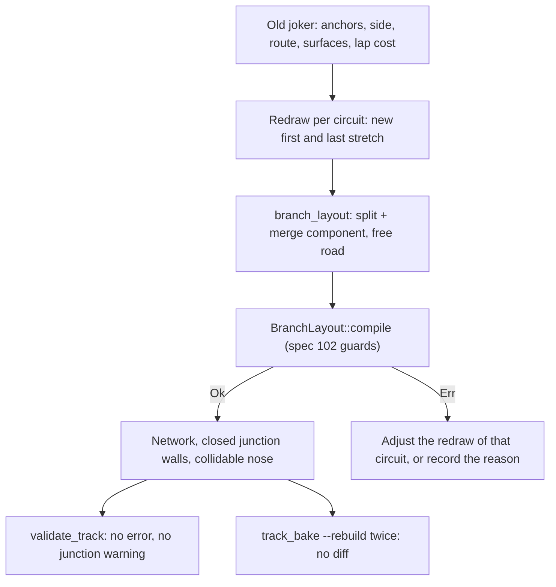

# Architecture Spec: Redrawing the 23 Official Rallycross Jokers to Fit Junction Components 🏗️

Spec 102 built the kit: two predefined junction components (Taper or TurnOff), a free branch road between them, closed junction walls, a collidable nose, guards and validation. It also built a fitting tool that tries to fit that kit to each old joker. The tool converts **none** of the 23 official jokers. They keep their legacy network and the open wall corners that go with it.

This spec converts them. Each joker is **redrawn**, per circuit: the anchors, the side and the route stay, and the two stretches next to the junctions change so that a component can hold them.

Spec 102 is the dependency: its kit, guards and report. This spec only changes circuit data and the builders' per-circuit configuration. It adds no new kit code, except what a failing circuit shows to be missing (listed per circuit in the migration report).

---

## 🗺️ Current vs. Proposed System Architecture

### 1. Current Architecture

The old jokers come from two sources: the OpenStreetMap joker ways (spec 088) and hand-placed or synthetic points (spec 081). The old network was built with all sockets of a split and merge on one waypoint. The fit of spec 102 compares a component with that old joker and requires 2.0 m of agreement. That fails for three reasons that are in the old data, not in the kit.

The result of the run on the merged tree (`docs/circuits/branch_junction_migration.md`):

**10 circuits: the old joker leaves or joins the main road too steeply.** A Taper (more than 60° of divergence) or TurnOff (angle of 60° or more) is rejected by `JunctionTooSteep`. The old joker turns 66° to 74° away from the main road within a few metres of the anchor.

| Circuit | Junction | Angle that the old joker needs |
|---------|----------|-------------------------------:|
| `croft_rx` | split | 67.2° |
| `erx_motor_park` | split | 67.2° |
| `lavare_rx` | split | 67.2° |
| `lessay_rx` | split | 65.8° |
| `loheac_rx` | split | 65.8° |
| `lydden_hill` | split | 66.9° |
| `mettet_rx` | merge | 65.8° |
| `silverstone_rx` | split | 65.8° |
| `rx_canyon_flyer` | merge | 70.5° |
| `rx_hilltop_leap` | split | 73.9° |

**9 circuits: no 10-40 m component comes within 4 m of the old joker.** The old joker hugs the main road for tens of metres (OSM leads), or leaves it so late that a component cannot reach the 15-17 m centre offset it needs by 40 m. Best fit of any component:

| Circuit | Junction | Best deviation |
|---------|----------|---------------:|
| `catalunya_rx` | split | 11.3 m |
| `essay_rx` | split | 4.4 m |
| `hell_rx` | merge | 15.5 m |
| `holjes_rx` | merge | 6.5 m |
| `montalegre_rx` | split | 6.4 m |
| `nyirad_rx` | split | 5.4 m |
| `riga_rx` | split | 6.8 m |
| `rx_quarry_sprint` | split | 8.3 m |
| `spa_rx` | split | 14.8 m |

**3 circuits: a guard fails after the junctions fit.**

| Circuit | Guard | Where |
|---------|-------|-------|
| `dreux_rx` | `DividerTooNarrow` | 229.3 m along the branch |
| `estering_rx` | `RoadTooTight` | 19.6 m along the branch, radius 6.9 m, 9.5 m needed |
| `killarney_rx` | `DividerTooNarrow` | 148.1 m along the branch |

**1 near miss.** `kouvola_rx` fits with a best deviation of 2.65 m against the 2.0 m limit.

Looser limits do not help: a scratch run with a 4 m limit (`RX_FIT_MAX_DEVIATION_M=4`) also converts none, because the guards fail first.

### 2. Proposed Architecture

---

## 🎯 Options

The failures differ per circuit, so the options are per circuit. Mario chooses at approval.

1. **Redraw to fit (proposed).** Keep the anchors, the side and the route beyond the junction spans. Redraw the stretch next to each junction as a component of 10-40 m (Taper or TurnOff), and let the free road join them with a bend of at least the radius guard. The old joker's lap cost (spec 088: 1.0-7.5 s) and length stay within a stated tolerance. Cost: the first and last 40 m of each joker change shape (`kouvola_rx` by only 2.65 m, the 10 steep ones the most); a joker that now leaves at 66-74° needs a longer, gentler approach, which moves its free road outward.
2. **Move the anchors.** A different split or merge waypoint can give the component room (for `rx_hilltop_leap`, `rx_canyon_flyer`, `croft_rx` and others where the angle is the problem). Cost: it changes where the joker starts and ends, which spec 088 fixed from the OSM data. Allowed only where the real joker has no mapped anchor (the synthetic ones: `lydden_hill`, `nyirad_rx`, `kouvola_rx`, `croft_rx`, `spa_rx`, `silverstone_rx`, `erx_motor_park`, the 3 classic circuits).
3. **Loosen the kit.** Allow a TurnOff above 60° or a Taper above 60° of divergence (spec 101's guard), or a start offset wider than the main road. Cost: it changes the pit lane component too (spec 101) and its guards, and 66-74° is a hard turn for a 13 m road.
4. **Keep a circuit legacy.** A circuit whose redraw cannot pass every guard keeps its legacy network and its warnings, with the reason in the report. Always available, and the fallback of every option above.

The proposal is option 1, then option 2 for the synthetic jokers where option 1 fails, then option 4. Option 3 is not proposed.

---

## 🗄️ Database & Storage Migration Plan

### 1. Circuit JSON (`tracks/` submodule)
- Each redrawn circuit gets `branch_layout` and a re-baked `network` in `tracks/rally/*.json` or `tracks/classic/rx_*.json`. Walls are never saved (`network_walls`).
- Run each builder, then `track_bake --rebuild` two times on the redrawn circuits. The second run must give no diff in the `tracks` submodule.
- Commit and push the `tracks` submodule commit (a feature branch of tdrace-tracks first) before `main` points at it.
- After the bake, compare wall gaps and pit lanes against main (a mass re-bake can flatten per-circuit wall offsets).

### 2. Rollback
- Remove `branch_layout` from a circuit JSON and restore its `network` from the previous `tracks` commit. The legacy path stays supported (spec 102).

---

## 🔑 Security, Compliance, & IAM Roles

Not applicable. No network access, accounts or secrets. Circuit JSON is first-party data embedded at build time (spec 042).

---

## 🛡️ Disaster Recovery, Monitoring, & Fallbacks

- **Fallback**: a circuit whose redraw fails keeps its legacy network (option 4). Its junction wall problems stay visible as warnings in validation.
- **Gameplay check**: the bot stall sweep (own-category cars, closed-loop circuits) runs on every redrawn circuit. Bead `tdrace-xg1x` (bots fail the joker on `kouvola_rx`, `lavare_rx` and `killarney_rx`) is checked again after the redraw.
- **Launch chute (spec 103)**: every official RX circuit has one. The bake stamps it again on the new network (spec 102); a circuit on which it does not fit is a failed redraw.

---

## 🧪 Verification & Acceptance Criteria

### Automated Tests
- `cargo test -p tdrace-app --test rally_tracks_tests`
- `cargo test -p tdrace-core --test classic_circuits_tests`
- `cargo test -p tdrace-app --test classic_circuits_bot_tests`
- `cargo test -p tdrace-app --test branch_junction_circuit_tests` (its report check lists the converted circuits)
- `cargo run --release -p tdrace-app --bin build_world_rx_joker` and `cargo run --release -p tdrace-app --bin build_classic_rx_joker`
- `cargo run --release -p tdrace-app --bin track_bake -- tracks/rally/*.json tracks/classic/rx_*.json --rebuild` (run two times; `git -C tracks diff --stat` is empty after the second run)
- `cargo test --release --workspace --exclude tdrace-py --no-fail-fast`

### Manual Acceptance Criteria (Pseudo-Gherkin)

- **Scenario: Every official joker is redrawn or its reason is recorded**
  - [ ] **Given** the 20 World RX circuits and the 3 Classic RX circuits
  - [ ] **When** the redraw runs on each
  - [ ] **Then** each circuit carries a `branch_layout` that passes every guard of spec 102, or keeps its legacy network with a reason in `docs/circuits/branch_junction_migration.md`
  - [ ] **And** the report lists, per circuit, the shape, length, deviation and lap cost, and the number of converted circuits

- **Scenario: A redrawn joker keeps the character of the old one**
  - [ ] **Given** a redrawn circuit
  - [ ] **When** its joker is compared with the old joker
  - [ ] **Then** the anchors and the side are the same, the free road stays within 2.0 m of the old route beyond the junction spans, and the lap cost is within the range that spec 088 accepts

- **Scenario: The main route does not change**
  - [ ] **Given** a converted circuit
  - [ ] **When** its main waypoints and main spline samples are compared with the previous `tracks` commit
  - [ ] **Then** they are identical

- **Scenario: Validation finds today's wall holes and then none**
  - [ ] **Given** `tracks/rally/kouvola_rx.json` from the `tracks` commit before this spec
  - [ ] **When** `validate_track` runs on it before and after the redraw
  - [ ] **Then** it reports `WARN_JUNCTION_WALL_GAP` at the joker merge before
  - [ ] **And** the same circuit, after conversion, reports no junction warning and no junction error

- **Scenario: Bake is deterministic and walls are never saved**
  - [ ] **Given** all converted circuits
  - [ ] **When** `track_bake --rebuild` runs two times
  - [ ] **Then** the second run makes no change in the `tracks` submodule
  - [ ] **And** no circuit JSON contains island or outer chain walls

- **Scenario: Bots take the joker once and do not stall on converted circuits**
  - [ ] **Given** each converted circuit in a race with RX bots and the joker rule on
  - [ ] **When** the race runs to the end
  - [ ] **Then** every bot finishes with exactly one joker, and the bot stall sweep reports no stall

- **Scenario: Track Studio keeps the branch layout**
  - [ ] **Given** a converted circuit open in Track Studio
  - [ ] **When** the author saves it without an edit
  - [ ] **Then** `branch_layout` in the saved JSON is identical to the loaded one

- **Scenario: The launch chute survives the conversion**
  - [ ] **Given** a converted circuit with its launch chute (spec 103)
  - [ ] **When** the circuit is baked
  - [ ] **Then** the chute, its grid and its walls are as before, and the chute tests of spec 103 pass

---

## 🔗 Traceability & Codebase Mapping

### Created/Modified Files
- `[ ]` `crates/tdrace-app/src/bin/build_world_rx_joker.rs` -> Per-circuit redraw configuration for the 20 World RX circuits.
- `[ ]` `crates/tdrace-app/src/bin/build_classic_rx_joker.rs` -> Per-circuit redraw configuration for the 3 Classic RX circuits.
- `[ ]` `crates/tdrace-app/src/bin/rx_joker_fit/mod.rs` -> Redraw step (explicit layouts) next to the fit; report columns.
- `[ ]` `crates/tdrace-app/tests/rally_tracks_tests.rs` -> Remove the 4 m throat skip from the wall-ray tests for converted circuits; main route unchanged.
- `[ ]` `crates/tdrace-app/tests/branch_junction_circuit_tests.rs` -> Converted circuits take the place of the synthetic joker where a circuit converts.
- `[ ]` `docs/circuits/branch_junction_migration.md` -> Regenerated: the result per circuit.
- `[ ]` `tracks/rally/*.json`, `tracks/classic/rx_*.json` (submodule) -> `branch_layout` and re-baked `network` on converted circuits.

### Verification Assertions
- No file outside the list above, and the kit of spec 102, changes `TrackNetwork`, `RoadJunction`, `SplineSocket` or the multi-route tracker.

### Beads Mapping
- Resolves `tdrace-joker-junction-wall-holes-5vqt`, `tdrace-74s5` and `tdrace-070o` on converted circuits.
- Checks `tdrace-xg1x` again after the redraw.
- Blocked by the epics of specs 081, 088, 102 and 103.
